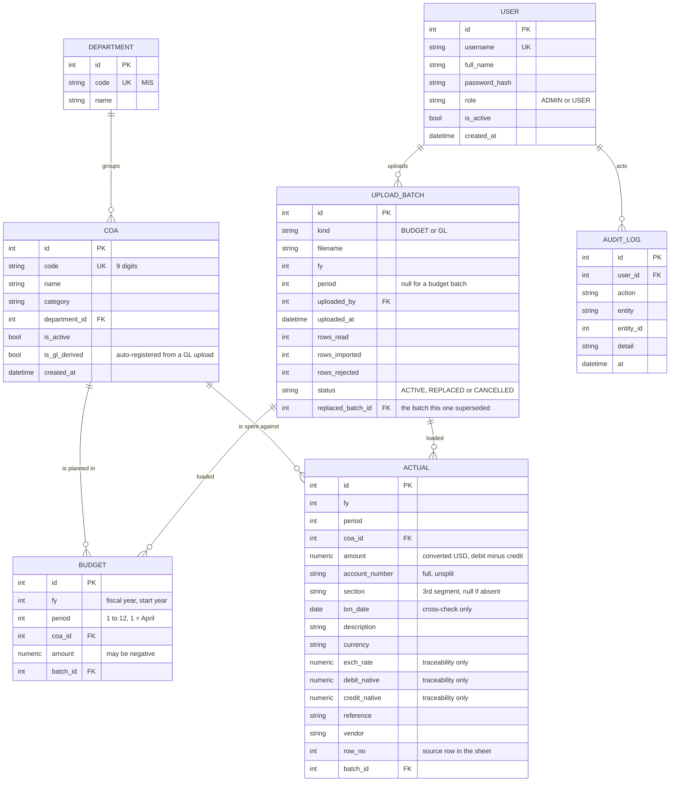

# Entity Relationship Diagram — VEGA

The normalised data model. Seven entities, no more.

Related: [Requirements-Spec.md](Requirements-Spec.md) · [Use-Case.md](Use-Case.md) ·
[Flowchart.md](Flowchart.md) · [Excel-Template-Spec.md](Excel-Template-Spec.md)

Database: **PostgreSQL 18**, on the host machine, driver `psycopg` v3. SQLAlchemy 2.0 models,
Alembic migrations. (Earlier drafts of this document specified SQLite in WAL mode; PostgreSQL is
the client's decision, recorded in [Stack-Comparison.md](Stack-Comparison.md) §0.)

---

## 1. Diagram

`UPLOAD_BATCH.replaced_batch_id` is a self-reference and is omitted from the relationship lines
above to keep the picture readable.

---

## 2. Entities

### 2.1 `user`

| Column | Type | Notes |
|---|---|---|
| `id` | int PK | |
| `username` | text, unique, not null | The login. |
| `full_name` | text, not null | Shown in the upload history. |
| `password_hash` | text, not null | **bcrypt.** Never a plaintext or reversible value. |
| `role` | text, not null | `ADMIN` \| `USER`. A constrained attribute — see §4.2. |
| `is_active` | bool, not null, default true | An inactive user cannot sign in; their history stays attributable. |
| `created_at` | datetime, not null | |

A user is deactivated, never deleted: `upload_batch.uploaded_by` and `audit_log.user_id` must stay
resolvable for figures that have already been reported.

### 2.2 `department`

| Column | Type | Notes |
|---|---|---|
| `id` | int PK | |
| `code` | text, unique, not null | The section code as it appears in the GL account number, e.g. `MIS000`. |
| `name` | text, not null | |

Seeded with the IT/MIS department on first run. It exists as an entity rather than a string on
`coa` because the GL account number carries the section code, and the row filter compares against
it. A filter that compares against a free-text column has nothing to guarantee spelling.

### 2.3 `coa` — chart of accounts

| Column | Type | Notes |
|---|---|---|
| `id` | int PK | |
| `code` | text, unique, not null | The nine-digit account code — the first segment of the GL account number. |
| `name` | text, not null | |
| `category` | text | Grouping for the dashboard. **An attribute, not a table** — see §4.1. |
| `department_id` | int FK → `department.id` | |
| `is_active` | bool, not null, default true | Set by ingestion, never by hand: true while the account appears in the most recent budget upload. There is no COA edit screen (FR-7, BR-16). |
| `is_gl_derived` | bool, not null, default false | True when the row was auto-registered during a GL upload because no budget master row existed (FR-24). Drives the "review these" list on the import result. |
| `created_at` | datetime, not null | |

`code` is unique and is the natural key, but the surrogate `id` is what `budget` and `actual`
reference. A re-keyed account should not require rewriting every figure that points at it.

**Every `coa` row is written by an upload, never by a form.** The budget upload creates them
(FR-12) and GL ingestion adds any code the budget did not carry (FR-24); the application offers no
create, edit or delete path for anyone (FR-7, BR-16). A COA is never hard-deleted: one that drops
out of a re-uploaded budget is flagged inactive and keeps its figures (FR-9), because deleting it
would orphan money that has already been reported.

### 2.4 `budget`

One row per account per fiscal period.

| Column | Type | Notes |
|---|---|---|
| `id` | int PK | |
| `fy` | int, not null | Fiscal year, labelled by start year. FY26 = 2026 = April 2026 → March 2027. |
| `period` | int, not null | 1–12, where **1 = April**. See §3. |
| `coa_id` | int FK → `coa.id`, not null | |
| `amount` | numeric, not null | **May be negative** — an internal cost allocation is a credit back to the department (BR-7). |
| `batch_id` | int FK → `upload_batch.id`, not null | Which upload produced this row. |

**Unique:** `(fy, period, coa_id)`. Twelve rows per account per year, no more.

There is no `source` column. Every budget row comes from an upload, and `batch_id` already says
which one. A second column stating "upload" on every row would carry no information.

### 2.5 `actual`

One row per GL transaction line in scope. Many rows per account per period, deliberately: the
per-account monthly figure is a `SUM`, computed at query time, never stored.

| Column | Type | Notes |
|---|---|---|
| `id` | int PK | |
| `fy` | int, not null | |
| `period` | int, not null | From the GL's period column, never from `txn_date` (BR-9). |
| `coa_id` | int FK → `coa.id`, not null | |
| `amount` | numeric, not null | Converted USD, `debit − credit`. May be negative. |
| `account_number` | text, not null | Stored **unsplit**, exactly as the file had it, so the split can be re-checked without the file. |
| `section` | text, null | The third segment, or null for a row admitted by the second filter clause (FR-23). Null is the flag for *included, section missing*. |
| `txn_date` | date, null | Cross-check only. A disagreement with `period` is reported, and `period` still wins. |
| `description` | text | The account description from the file. |
| `currency` | text | Reported, never computed with. |
| `exch_rate` | numeric, null | **Traceability only.** The rate varies row by row; recomputing a conversion from it is wrong (BR-10). |
| `debit_native` | numeric, null | Traceability only. |
| `credit_native` | numeric, null | Traceability only. |
| `reference` | text, null | Traceability. |
| `vendor` | text, null | Traceability. |
| `row_no` | int | The row number in the source sheet, so a figure can be pointed at in the original file. |
| `batch_id` | int FK → `upload_batch.id`, not null | |

**Index:** `(fy, period, coa_id)`, the shape of every analytics query.
**No unique constraint on the business columns.** Two identical transactions in one month are
legitimate. Idempotency comes from `batch_id`: re-uploading a period deletes that period's rows and
inserts the new ones (BR-4).

The four traceability columns exist because of NFR-12: every displayed figure must be traceable to
a line in a file. They are written on ingest and never read by any calculation.

### 2.6 `upload_batch`

The provenance record. Every figure in `budget` and `actual` points at one.

| Column | Type | Notes |
|---|---|---|
| `id` | int PK | |
| `kind` | text, not null | `BUDGET` \| `GL`. |
| `filename` | text, not null | As uploaded. |
| `fy` | int, not null | |
| `period` | int, null | The single period for a GL batch; **null** for a budget batch, which covers the whole year. |
| `uploaded_by` | int FK → `user.id`, not null | |
| `uploaded_at` | datetime, not null | |
| `rows_read` | int, not null | |
| `rows_imported` | int, not null | |
| `rows_rejected` | int, not null | |
| `status` | text, not null | `ACTIVE` \| `REPLACED` \| `CANCELLED`. |
| `replaced_batch_id` | int FK → `upload_batch.id`, null | Self-reference: the batch this one superseded. |

**Partial unique index:** `(kind, fy, period) WHERE status = 'ACTIVE'`, at most one live batch per
period. PostgreSQL supports partial indexes, so this is enforced by the database rather than only
by the application.

`period` is nullable rather than being replaced by the plan's original `months_covered` text
column, because FR-25 refuses a file containing more than one period. A single nullable integer
says the same thing and can be indexed and joined; a comma-separated list cannot.

**A refused upload creates no batch row.** Nothing is stored when a file is refused (FR-30), so
there is no `REFUSED` status. The attempt is recorded in `audit_log` instead, which is where it
belongs, since it is an event and not a source of figures. The `Refused` state on Diagram 3 of
[Flowchart.md](Flowchart.md) is a state of the *upload attempt*, not a row in this table.

### 2.7 `audit_log`

| Column | Type | Notes |
|---|---|---|
| `id` | int PK | |
| `user_id` | int FK → `user.id`, null | Null for an action by the scheduler. |
| `action` | text, not null | `LOGIN`, `LOGIN_FAILED`, `UPLOAD`, `UPLOAD_REFUSED`, `REPLACE`, `CANCEL`, `COA_AUTO_REGISTER`, `USER_CREATE`, `USER_UPDATE`, `BACKUP`. There is no `COA_CREATE` / `COA_UPDATE` / `COA_DEACTIVATE`: the only way a COA row appears is ingestion (FR-24, BR-16). |
| `entity` | text, null | The table the action touched. |
| `entity_id` | int, null | |
| `detail` | text, null | Short human-readable context, e.g. the refusal reason. |
| `at` | datetime, not null | |

Append-only. Nothing in the application updates or deletes a row here.

---

## 3. The period column

`period` is the **fiscal period, 1-12, where 1 = April**, not a calendar month.

Both sources are already fiscal-period-native: the GL carries an explicit period column
(`Pd. 03` = June), and the budget sheet's twelve columns run April through March in order. Storing
a calendar month would mean converting on the way in and converting back for every quarterly
grouping, and the conversion is exactly where an April/March off-by-one hides.

- Fiscal Q1 = periods 1-3 (Apr, May, Jun) · Q2 = 4-6 · Q3 = 7-9 · Q4 = 10-12.
- Calendar month and label are **derived**, in `backend/app/fiscal.py` and nowhere else.

> This refines the column named `month` in [Project-Plan.md](../Internal/Project-Plan.md) §Phase 1. Same
> concept, named for what it actually holds.

**There is no `fiscal_year` entity.** FY26 is fully derivable from the integer `2026`, whereas a
stored `start_date` is a row that can disagree with the calendar, and a wrong fiscal boundary is a
whole month of spending in the wrong bucket.

---

## 4. Normalisation

The model is in **third normal form**. Every non-key column depends on the whole key and on
nothing but the key.

| Form | How it holds |
|---|---|
| **1NF** | Every column is atomic. The GL account number is stored whole *and* its section stored separately, which is duplication of a derived value rather than a repeating group — kept deliberately, see §5. |
| **2NF** | The only composite business keys are `budget(fy, period, coa_id)` and the `actual` index; `amount` depends on all three parts, not on a subset. |
| **3NF** | No transitive dependency. An account's name and category live on `coa`, never copied onto `budget` or `actual`. A department's name lives on `department`, never copied onto `coa`. A user's name lives on `user`, never copied onto `upload_batch`. |

### 4.1 Why `category` is a column, not a table

A separate `category` table would buy referential integrity over a value that nothing references
by identity: no figure is filed against a category, no report groups by a category *id*, and no
category carries an attribute of its own. It would add a join to every dashboard query, and a
second master to keep in step with the workbook, to prevent a typo in a grouping label. The
category arrives with the account, from the same upload (FR-7).

It becomes a table the day a category needs an attribute of its own: an owner, a target, a
display order. Until then it is text on `coa`.

### 4.2 Why `role` is a column, not a table

Two values, fixed by the requirements, referenced by a route-level dependency rather than by data.
A two-row lookup table plus a join, to store `ADMIN` and `USER`, is a join added for symmetry
rather than for a requirement. It is documented as a domain: `role ∈ {ADMIN, USER}`, enforced by a
check constraint.

### 4.3 Why there are no stored aggregates

No `monthly_summary`, no `variance` column, no cached year-end projection. Every figure is derived
at query time (FR-41).

The reason is BR-4: re-uploading a month replaces it. Any stored aggregate would need invalidating
on every replace and on every batch cancellation, and an aggregate that is
stale after a re-upload is a wrong number displayed with full confidence. At pilot scale the sums
are trivial; a few hundred rows per month per department.

Variance, status, percentage and projection are therefore **not in this model at all**. They live
in `backend/app/analytics.py`.

---

## 5. Deliberate redundancy, and why

Two places store the same fact twice. Both are intentional.

| Redundancy | Reason |
|---|---|
| `actual.account_number` holds the whole string while `actual.coa_id` and `actual.section` hold its parsed parts | The parse is the single most consequential operation in ingestion — it decides which rows are the department's at all. Keeping the original string means a disagreement can be re-checked against the database without going back to the file, which may no longer exist. |
| `actual.debit_native`, `credit_native`, `exch_rate` alongside the converted `amount` | NFR-12. The department must be able to see where a USD figure came from. They are never read by a calculation (BR-10). |

Neither is a normalisation failure: both store *source* values, not derived duplicates of another
table's column.

---

## 6. Money and types

| Concern | Decision |
|---|---|
| Money | `NUMERIC`, mapped to Python `Decimal`. **Never `float`** — binary floating point cannot represent 0.01, and zero-tolerance status comparison (BR-6) turns that residue into every account reading `OVER` or `UNDER`. |
| Rounding | Round to two decimals **once**, immediately before a comparison or display — never on the way into the database. |
| Dates | `txn_date` is a date. `created_at`, `uploaded_at`, `at` are datetimes. |
| Enums | Stored as text with a check constraint, not as integers — a dump of the table should be readable without a lookup. |
| Money column type | `NUMERIC(18, 2)`. PostgreSQL stores it exactly and psycopg returns a Python `Decimal` without passing through a float, so the rule in the first row is enforced by the database rather than only by convention. |

---

## 7. Referential integrity and delete behaviour

| Relationship | On delete |
|---|---|
| `coa` → `budget`, `actual` | **Restricted.** A COA with figures is deactivated, never deleted (FR-9). |
| `department` → `coa` | Restricted. |
| `user` → `upload_batch`, `audit_log` | Restricted. Users are deactivated, never deleted. |
| `upload_batch` → `budget`, `actual` | **Cascade.** Deleting a batch removes exactly the rows it loaded — this is the mechanism behind both the replace (FR-28) and the cancel (FR-33). |

The cascade on `upload_batch` is the only destructive path in the model, which is why FR-28
requires a backup immediately before it runs.

PostgreSQL enforces foreign keys by default; no per-connection setup is required.

---

## 8. Seed data

| Table | Seeded on first run |
|---|---|
| `department` | The IT/MIS department. |
| `user` | One administrator, with a password that must be changed on first sign-in. |
| `coa` | Nothing. The chart of accounts arrives with the first budget upload, or is entered by hand. |

---

## 9. What this model deliberately does not have

| Absent | Why |
|---|---|
| `category` table | §4.1 |
| `role` table | §4.2 |
| `fiscal_year` table | §3 |
| `expenditure` table with a data-entry form | Actuals are GL-upload-only (BR-1). |
| Stored variance, status, or projection | §4.3 |
| A `source` column on `budget` | `batch_id` already answers it. |
| A `REFUSED` batch status | A refused upload stores nothing; the attempt goes to `audit_log` (§2.6). |
| Soft-delete columns on `budget` and `actual` | The batch cascade is the delete mechanism, and the backup taken before a replace is the recovery. Tombstoned money rows would double the stored volume and have to be excluded from every single query — one forgotten `WHERE` and a replaced month is counted twice. |
