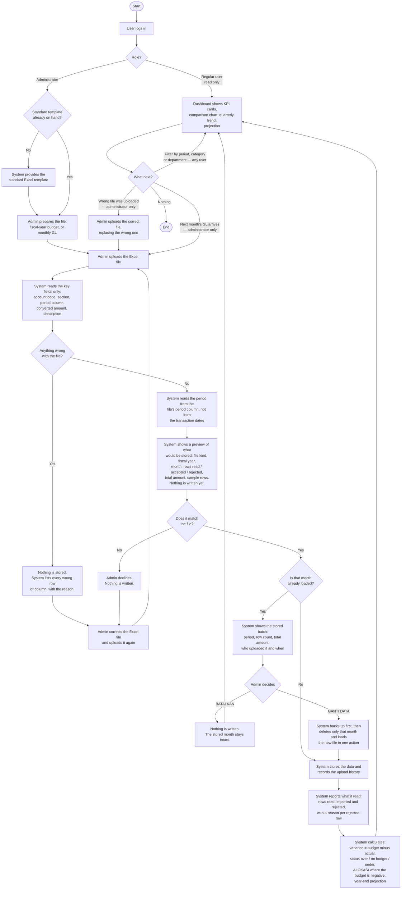
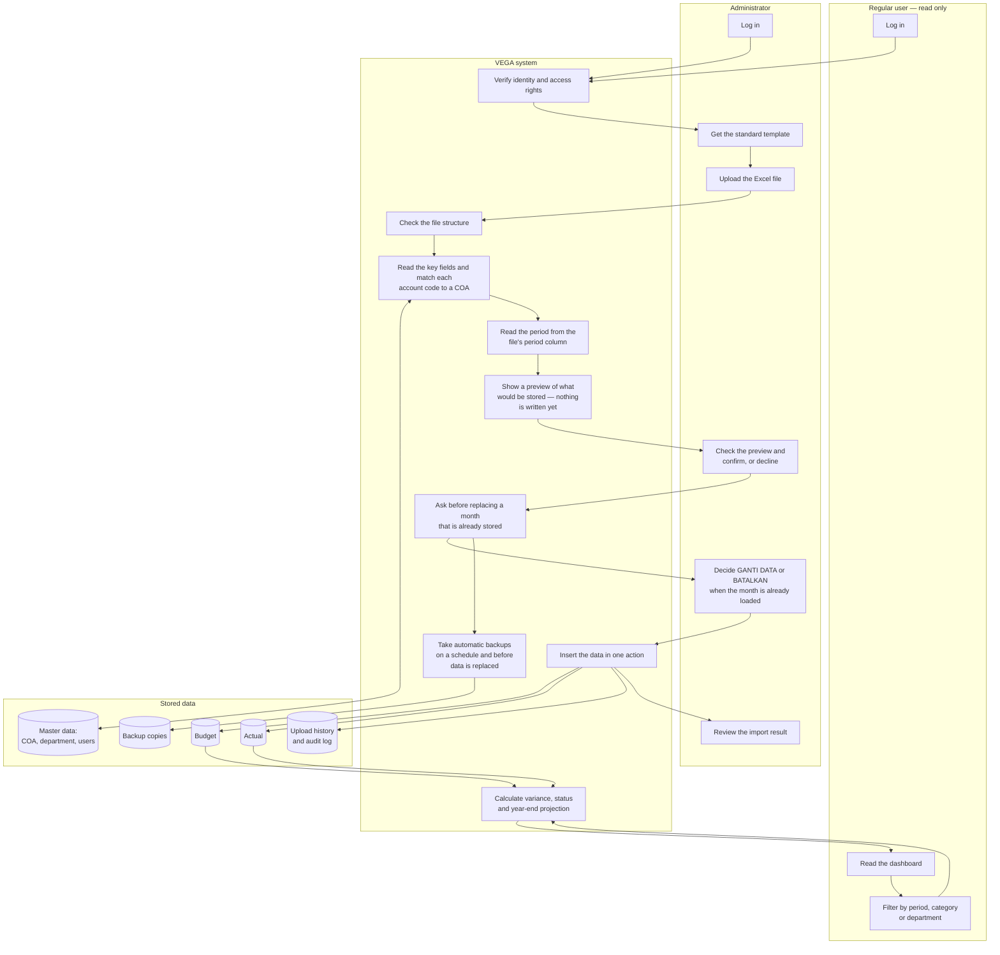
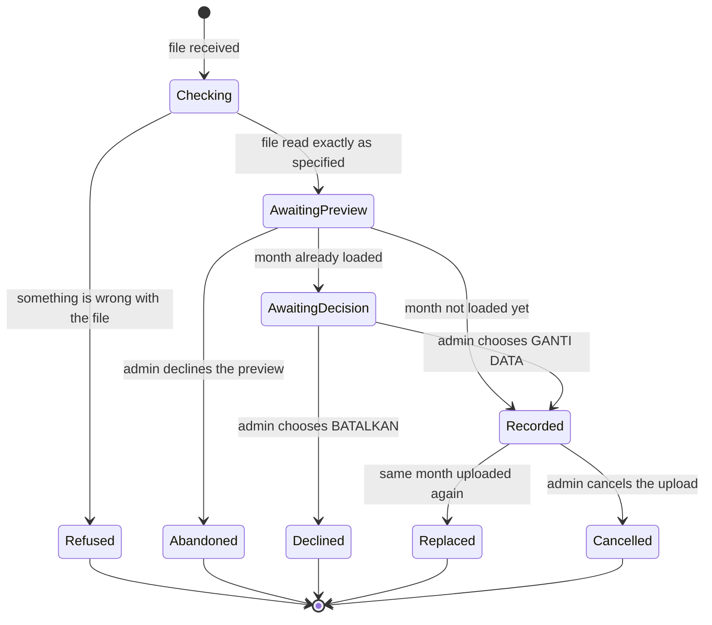
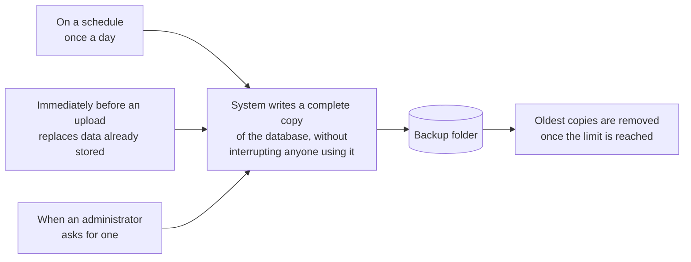

# VEGA — System Workflow

**Scope:** what the system does from the moment an Excel file is uploaded until the
figures appear on the dashboard.

This document describes system *behaviour*, not code structure. It is the reference for
the client walkthrough, for the User Manual, and for the test scenarios in
[Test-Plan.md](Test-Plan.md).

Related: [ERD.md](ERD.md) · [Use-Case.md](Use-Case.md) ·
[Excel-Template-Spec.md](Excel-Template-Spec.md)

> [Excel-Template-Spec.md](Excel-Template-Spec.md) is the locked reading contract, written
> against the client's real files. **Where this document and that one disagree, the spec wins**
> since this one describes behaviour in the client's language while the spec fixes the exact positions,
> figures and rule order.

---

## 1. Operating cycle

VEGA takes in two kinds of Excel file:

| File | How often | What it carries |
|---|---|---|
| **Budget** (IT Fixed Cost, per fiscal year) | Once per fiscal year, and again whenever the plan is revised | The planned figure per COA, month by month, for the year |
| **General Ledger (GL)** | Once a month | The actual transactions for one month |

Three facts shape everything below:

1. **The fiscal year runs April to March.** FY26 = April 2026 through March 2027.
2. **The GL lags one month.** The file received in July contains June's transactions.
   At the start of July, the newest data the system can show is June.
3. **Excel files are the only way data enters the system.** There is no manual entry
   and no editing of figures inside VEGA. Every number on the dashboard can be traced
   back to a file someone uploaded.

Only one thing runs on a schedule, and that is the automatic backup (§9). Every figure
(variance, status, projection) is calculated at the moment someone opens the dashboard,
from whatever data is stored at that instant. A corrected file that is re-uploaded shows
up immediately, with no rebuild step.

---

## 2. What the system reads from each file

The system does not read the whole workbook. It looks only for the fields it actually
needs, and ignores everything else: the other sheets, extra columns, subtotal rows,
formatting, notes.

**General Ledger**: sheet `CORE` only. The workbook also contains `EMC`, `IAB` and
`OCBID`; those are other entities and are not read at all.

| Field | What it is used for |
|---|---|
| Account Number | Split on `-` into COA code, entity and section — e.g. `740201000-A7744-MIS000`. Rows in scope carry at most three parts |
| — its 3rd part | Department filter, **but not on its own** — see below |
| Converted Debits / Credits | The actual spending. `actual = debit − credit` |
| `Pd.` (period) | Decides which month the row belongs to |
| Date | Cross-check against `Pd.` only — never the source of the period |
| Account Description / Reference / Comment | Traceability back to the source document |

**The department filter has two clauses, not one.** A row belongs to IT when *either* it has
three parts and the third is `MIS000`, *or* it has only two parts and its COA code exists in the
budget master. In the sample file that is 63 rows plus 10 rows, 73 in total. Filtering on the
third part alone silently drops the ten section-less rows, and the silence is the problem rather
than the amount. Every row taken by the second clause is listed in the upload result as
*included, section missing*.

**The GL is multi-currency and VEGA never converts anything itself.** The sheet holds IDR, USD
and JPY rows, each with its own exchange rate; the rate varies row by row even within one
currency. The file already contains a converted-to-USD pair of amount columns alongside the
native-currency pair, and **VEGA reads only the converted pair**. The two pairs carry identical
header text, so they are addressed by position, never by name; reading the wrong pair inflates
every actual by roughly the exchange rate. The native amounts and the rate are stored for
traceability and never enter a calculation.

**Budget file**: sheet `MIS (FC)` only. The sheet *is* the department, so there is no
department column to filter on.

| Field | What it is used for |
|---|---|
| `COA No.` | Which account the plan is for |
| The twelve monthly columns | **The budget figures VEGA stores**, April through March |
| `FY'26 Budget` | The annual total — used only to check the twelve months add up |

The header sits on row 6, not row 1: rows 1-5 are the report title and summary
percentages, and are skipped.

The sheet carries several twelve-column blocks that all use the same month labels, so the
monthly budget block is located by the band label on the row above, not by the month names and
not by a fixed column position. Rows whose description contains `TOTAL` are subtotals and are
skipped. Some of them carry a valid-looking account code, so the description is what decides.

**Negative figures are valid and are never a reason to refuse a file.** One account is an
internal cost allocation carrying a negative budget: a credit back to the department, not
spending capacity. §5.3 of the spec covers how it is displayed.

Exact column positions, row numbers and verification figures are recorded in
[Excel-Template-Spec.md](Excel-Template-Spec.md) and confirmed against the client's real files.

### How the system guarantees it reads correctly

The system never stores a value it has read incorrectly. Either the file is read exactly
as specified, or nothing is stored at all. Four things enforce that:

1. **The layout is verified before a single value is read.** Every key field must be
   where the specification says it is. If a column has moved, the file is refused; the
   system never reads a value from a position it was not expecting.
2. **Values are taken as they are stored in the file**, not recalculated. The system
   does not re-derive anything the Excel already contains, including the currency conversion.
3. **Every value is checked against its expected form**: an amount must be a number, a
   period must be present, an account code must be nine digits. Anything that fails is a
   reason to refuse the file, not a value to guess at.
4. **The budget file is checked against itself, row by row.** For every account, the twelve
   monthly figures must add up to the annual total in the same row. That check holds on all 240
   rows of the sample and catches both a shifted column block and a single corrupted figure. It
   replaces the older idea of comparing VEGA's grand total against a total printed in the sheet:
   the sheet's summary cell cannot be reconstructed from any combination of its own rows, so it
   proves nothing.

Every upload still reports its row count and total amount, because that is what makes the
result checkable in front of an audience, but the row-level check above is what actually
protects the figures.

Refusing to store anything is therefore not a failure of the reading; it is the
mechanism that keeps a wrong number from ever reaching the dashboard.

---

## 3. The nine stages

| # | Stage | What the system does |
|---|---|---|
| 1 | **Access** | Verifies the login and the role. Only an administrator can change anything; a regular user can only look. |
| 2 | **Preparation** | Supplies the standard Excel template on request, so the file that arrives already has the expected shape. |
| 3 | **Submission** | Receives one file: the fiscal-year budget, or a monthly GL. |
| 4 | **Structure check** | Confirms the file is the right kind of file at all — expected sheet present, key fields where they should be. |
| 5 | **Extraction** | Reads the key fields listed in §2, keeps the IT department's rows by both clauses of the filter, and matches each account code to a chart-of-account (COA) entry. |
| 6 | **Validation** | Checks every amount and period, and every row of the budget against its own annual total. If anything is wrong, the whole upload is refused and every problem is listed at once. |
| 7 | **Preview** | Shows what would be stored — the file kind, the fiscal year and month it detected, how many rows were read, accepted and rejected, the total amount, and a sample of the rows as the system understood them. **Nothing has been written yet.** The administrator confirms it, or declines and nothing happens. If the file was refused at stage 6, this is the screen that lists the reasons. |
| 8 | **Storage** | Only after the preview is confirmed. If that month is already loaded, **asks the administrator a second time before replacing it**. Stores the data in one action and records the upload in the history. |
| 9 | **Analysis & presentation** | Compares budget against actual, assigns a status, projects the year end, and shows all of it on the dashboard. |

### Who can do what

| | Administrator | Regular user |
|---|:---:|:---:|
| View the dashboard, charts, status and projection | ✓ | ✓ |
| Filter by fiscal year, period, category, department | ✓ | ✓ |
| See the upload history | ✓ | ✓ |
| Download the standard Excel template | ✓ | — |
| Upload a budget or GL file | ✓ | — |
| Confirm or decline replacing a loaded month | ✓ | — |
| Cancel an upload | ✓ | — |
| Browse the COA master (read-only for every role) | ✓ | ✓ |
| Manage users and settings | ✓ | — |
| See the backup list, or take a backup now | ✓ | — |

A regular user is **read-only in the strict sense**: there is no action available to
them that changes what is stored. The restriction is enforced by the system on every
request, not by hiding buttons. A regular user who tries to reach an administrator
function directly is refused.

---

## 4. Diagram 1 — Full system workflow

An upload has exactly two outcomes: the file is read exactly as specified, **shown to the
administrator as a preview, confirmed** and stored, or **nothing at all is stored** and the
existing data stays as it was. There is no in-between state, and no path by which a misread value
reaches the dashboard without someone having seen it first.

**Replacing stored money figures is never automatic.** That is the only decision in the whole
flow the system refuses to make on its own, and the reason is §9: replacing a loaded month is
the one operation that can destroy figures that are already correct.

---

## 5. Diagram 2 — Who is responsible for what

An administrator can also do everything in the regular-user lane; the lanes show what
each role *adds*, not two separate people.

The manual work the department does today (filter the GL to IT, split the account
code, look up each COA, build a pivot) is the entire system lane. That is what VEGA
takes over.

---

## 6. Diagram 3 — What each upload becomes

Every upload is kept as a record, so the system can always answer two questions:
*where did this number come from*, and *can we take it back*.

> **There are three different ways to stop, and they are not equally safe.**
>
> *Declining at the preview* is completely safe and always available: the file has only been read,
> nothing has been written, and no backup was needed because nothing was at risk.
>
> *Declining at the replace confirmation* (**BATALKAN**) is equally safe: nothing has been written
> yet and the stored month is untouched.
>
> *Cancelling a batch that has already replaced another* does **not** restore the one it
> replaced. If June is uploaded again and that second upload is then cancelled, June ends up
> empty, not back at its previous version. The normal way to recover is to upload the correct
> file. If the correct file is no longer available, the backup taken immediately before the
> replace (§9) holds the previous version.

---

## 7. Three rules that protect the numbers

**1. Data only ever enters through a file.**
Nothing on the dashboard can be typed in or edited afterwards, and neither can the chart of
accounts itself: the account list is built from the workbooks too, and VEGA offers no screen to
add or change an account. Every figure and every account traces back to an uploaded document,
which is what makes the dashboard defensible in a review. A correction (to a figure, a code, a
name or a category) is made by fixing the Excel file and uploading it again. The only thing an
administrator maintains by hand is the user list.

**2. The period comes from the file's own period column, not from a date and not from the person uploading.**
The GL carries an explicit fiscal period per row, and that is what VEGA uses. Transaction dates
are read only as a cross-check: if a row's date disagrees with its period, the system reports it
and keeps the period. This matters because the two genuinely do diverge: in the client's own
workbook there are rows stamped period 3 but dated late May, and because of the one-month GL
lag, letting someone type the month by hand is exactly how a full month of spending lands in the
wrong place. A file containing more than one period is refused: one upload is one month.

**3. Uploading the same month twice replaces it; it never adds to it.**
Without this rule, a second upload of June's GL would silently double June's spending,
and the dashboard would report an overbudget that never happened. Re-uploading June
affects June only; every other month is untouched, and the replacement happens only after the
administrator confirms it.

---

## 8. What happens when a file cannot be used

The upload is refused as a whole and **nothing is stored**. The reasons appear on the same preview
screen (stage 7) that a good file would have used to ask for confirmation, except there is nothing
to confirm, only the list of what is wrong. The system lists every problem it found, so the admin
can fix them all in one pass rather than discovering them one at a time. Existing data is never
touched by a refused upload.

| Situation | What the admin is told |
|---|---|
| Wrong file type, or file too large | Refused before it is even sent |
| Expected sheet not in the workbook | This is not the right file |
| A key field is not where it should be | Which field moved, and where it was expected |
| An amount cell holds text instead of a number — an Excel error such as `#DIV/0!`, or a comma as the decimal mark | Which rows, and what is wrong with each |
| A single row carries both a debit and a credit | Which rows — the amount for that row is ambiguous |
| A budget row's twelve months do not add up to its annual total | Which rows, and by how much |
| The file contains more than one fiscal period | Which periods it contains |
| The file contains no usable rows at all | Nothing to import |

**Two things that are *not* refusals, and used to be listed as such:**

- **A negative amount.** Negative figures are legitimate: a credit reduces the actual, and one
  budget line is an internal cost allocation that is negative for the whole year.
- **An account code with no matching COA.** The row is **ingested, the COA is auto-registered
  with a zero budget, and the upload result lists it** so an administrator can review it. In the
  sample file this affects nine rows worth 159,937.76 USD, both accounts being depreciation whose
  budget exists only inside a subtotal. Refusing a 4,952-row file over nine unmapped rows would
  block the other sixty-four for no gain, and would leave the file un-ingestable until somebody
  fixes a budget sheet the department does not control. Dropping real spending because a master
  row is missing is the larger error of the two.

**Why refuse the whole file rather than import the good rows.** Because figures cannot
be edited inside VEGA, a partly imported month could never be completed. It would sit
on the dashboard looking finished while quietly missing money. An absent month is
obvious; an incomplete one is not. The unmapped-COA case above is not an exception to this: the
row *is* imported, complete, and merely flagged.

**An upload is never left half-finished.** The data for a month is written in one
action: either all of it lands, or none of it does. There is no state in which the
system has stored part of a file, and no situation in which a refused upload damages
data that was already there.

---

## 9. Automatic backup

Backups are not something anyone has to remember. The system takes them itself.

**Three triggers, one of which matters most.** The daily schedule covers ordinary
protection. The administrator button covers "I am about to do something and want a
safety net". The important one is the middle trigger: **the moment an upload replaces a
month that is already stored is the only moment existing figures can be lost**, so the
system copies the database immediately before it, every time, automatically, after the
administrator has confirmed the replacement and before anything is deleted.

**What a backup is.** A complete, self-contained copy of the whole database, written
while the application keeps running. Nobody has to close the app or stop working, and
each copy can be opened on its own; it is not a fragment that only means something
next to the others. Each copy is written under its own timestamped name; a backup never
overwrites an earlier one.

**How many are kept.** The most recent copies are kept and older ones removed
automatically, so the backup folder cannot grow without limit. The number to keep is an
administrator setting.

**Restoring.** Putting a backup back is an administrator operation, written up step by
step in the User Manual. A restore returns the whole database to exactly the state it
was in when that copy was taken.

> Backups protect against data loss, not against a wrong file. If a wrong file was
> uploaded, uploading the right one is the fix. That is faster, and it leaves the
> upload history intact.

---

## 10. Budget upload — the same stages, three differences

1. There is no period column to read and no month to detect. The file *is* the fiscal year, and
   it carries twelve monthly figures per account. **An annual figure is never divided by twelve:**
   the client's own budget is not spread evenly, and one account in the sample holds a full-year
   figure with nothing at all allocated to June. Dividing would invent a monthly budget the
   department never set.
2. Re-uploading replaces the **whole year** for that department, not a single month: a
   budget file is a complete restatement, not a monthly increment. The same confirmation applies:
   the administrator is shown what is about to be replaced and chooses.
3. A revised budget is loaded the same way as the first one: upload the corrected file.
   There is no separate edit path.

---

## 11. Open items

These do not change the workflow above, but they do change details of it. Confirmation
pending from the department:

1. **Where the detail behind the depreciation budget is.** The subtotal `TOTAL SGA DEPRECIATION`
   is filled while every detail row under it is zero, which is why two GL accounts have no budget
   to compare against.
2. **The unregistered-COA policy.** Confirm the recommendation in §8: ingest, auto-register with
   a zero budget, report it on the upload result.
3. **The two account numbers with no section segment.** They are included by the second clause of
   the filter and reported as such; the department should confirm they are IT's.
4. **Two duplicate account codes in the budget sheet.** Which row is authoritative. Both pairs
   are entirely zero, so nothing breaks either way, but the master data should not carry both.
5. **How a COA maps to its category.** A master list, or part of the account code itself.
6. **How long backups should be kept**, and whether a copy should also be written to a second
   location (a shared folder or an external drive) rather than only alongside the application.

Already answered, and no longer open: the real `.xlsx` files have been delivered; the
over/under threshold is **zero tolerance**, not ±5%; FY26 means April 2026 to March 2027; and the
budget arrives as twelve monthly figures.
