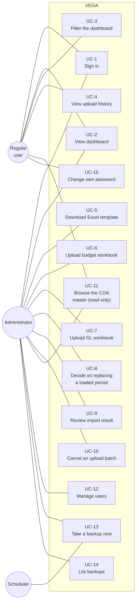

# Use Cases — VEGA

Actors, what each one can do, and the step-by-step flow of the use cases where the steps matter.

Related: [Requirements-Spec.md](Requirements-Spec.md) (the FR IDs referenced here) ·
[Flowchart.md](Flowchart.md) (system behaviour) · [ERD.md](ERD.md) (data)

---

## 1. Actors

| Actor | Type | Description |
|---|---|---|
| **Administrator** | primary, human | The staff member who handles the monthly file and the master data. Can do everything a regular user can, plus every write operation. |
| **Regular user** | primary, human | Department staff and management. Reads the dashboard and the upload history. **No action available to them changes stored data.** |
| **Scheduler** | secondary, system | The in-application daily timer. Its only job is to trigger a backup. Not a user, has no login. |

There are exactly two human roles, and `role` is an attribute of a user rather than a table.
A single person is often both: an administrator is a regular user with additions, not a separate
individual.

---

## 2. Use case diagram

Mermaid has no native use-case notation, so the system boundary is drawn as a subgraph. The
`«include»` and `«extend»` relationships are stated in §3 rather than drawn, to keep the picture
readable.

An administrator also participates in UC-2, UC-3, UC-4 and UC-15; those lines are omitted from
the picture only to keep it legible. §4 is the authoritative permission matrix.

---

## 3. Use case inventory

| ID | Use case | Actor | Relationships | Requirements |
|---|---|---|---|---|
| UC-1 | Sign in | both | — | FR-1, FR-2 |
| UC-2 | View dashboard | both | — | FR-35…FR-47 |
| UC-3 | Filter the dashboard | both | *extends* UC-2 | FR-46 |
| UC-4 | View upload history | both | — | FR-32 |
| UC-5 | Download Excel template | Administrator | — | FR-34 |
| UC-6 | Upload budget workbook | Administrator | *includes* UC-8, UC-9 | FR-12…FR-18, FR-55, FR-56 |
| UC-7 | Upload GL workbook | Administrator | *includes* UC-8, UC-9 | FR-19…FR-31, FR-55, FR-56 |
| UC-8 | Decide on replacing a loaded period | Administrator | *included by* UC-6, UC-7; *includes* UC-13 | FR-27…FR-29, FR-49 |
| UC-9 | Review import result | Administrator | *included by* UC-6, UC-7 | FR-31, FR-11, FR-24 |
| UC-10 | Cancel an upload batch | Administrator | — | FR-33 |
| UC-11 | Browse the COA master (read-only) | both | — | FR-7…FR-11 |
| UC-12 | Manage users | Administrator | — | FR-4, FR-5 |
| UC-13 | Take a backup | Administrator, Scheduler | *included by* UC-8 | FR-49…FR-52 |
| UC-14 | List backups | Administrator | — | FR-52 |
| UC-15 | Change own password | both | — | FR-6 |

**UC-7 is the use case the system exists for.** It runs once a month, it is the only routine
operation, and it is the only one that can destroy a figure that was already correct. Everything
in §5 is written around that.

---

## 4. Permission matrix

| Capability | Administrator | Regular user |
|---|:---:|:---:|
| View dashboard, charts, status, projection | ✓ | ✓ |
| Filter by fiscal year, period, category, department | ✓ | ✓ |
| View upload history and per-batch detail | ✓ | ✓ |
| Change own password | ✓ | ✓ |
| Download the standard Excel template | ✓ | — |
| Upload a budget or GL workbook | ✓ | — |
| Confirm or decline the upload preview | ✓ | — |
| Confirm or decline replacing a loaded period | ✓ | — |
| Review the import result | ✓ | — |
| Cancel an upload batch | ✓ | — |
| Browse and search the COA master | ✓ | ✓ |
| Create, edit or delete a COA | — | — |
| Manage departments | — | — |
| Create, edit, deactivate a user; set a role | ✓ | — |
| Take a backup, list backups | ✓ | — |
| Change a retention setting | ✓ | — |

**Read-only means read-only.** There is no write action a regular user can reach. The check is a
route-level dependency, so hiding a button is a convenience and never the control. A regular user
who calls an administrator endpoint directly receives `403`.

---

## 5. UC-7 — Upload GL workbook

**Actor:** Administrator
**Goal:** the month's actual figures are stored, exactly once, correctly.
**Frequency:** monthly.
**Trigger:** the GL export for the previous month arrives.

**Preconditions**

1. The administrator is signed in.
2. The COA master data exists: the budget workbook for that fiscal year has been loaded, because
   the second clause of the row filter needs it (FR-23).

**Main flow**

| # | Actor | System |
|---|---|---|
| 1 | Selects the GL workbook and submits it | |
| 2 | | Checks the extension, MIME type and size cap; opens the workbook read-only (NFR-8) |
| 3 | | Confirms the expected sheet is present and the key columns are where the specification says, by position (FR-13, FR-20) |
| 4 | | Reads the fiscal period from the period column and confirms the file holds exactly one (FR-22, FR-25) |
| 5 | | Applies the row filter, both clauses, and matches each account code to a COA (FR-23) |
| 6 | | Applies the row rules in order and computes `debit − credit` per row (FR-21, FR-26) |
| 7 | | Notes any account code with no master row, to be auto-registered with a zero budget on commit (FR-24) |
| 8 | | **Shows the preview — still holding everything in memory, still having written nothing** (FR-55): file kind, fiscal year and period, rows read / accepted / rejected, the total amount, a sample of the rows as they were understood, and every problem found |
| 9 | Reads the preview and confirms, or declines | Declining ends the attempt: nothing is written, nothing is changed (FR-56) |
| 10 | | Checks whether that period is already loaded → **UC-8** if it is |
| 11 | | Writes every row in one transaction and records the batch (FR-30, FR-32) |
| 12 | | Presents the import result → **UC-9** |
| 13 | Reads the result and, if it looks right, opens the dashboard | Recalculates every figure at query time (FR-41) |

**Steps 8 and 10 are two different questions and both are asked.** Step 8 asks *is this the right
file, read correctly?* Always. Step 10 asks *may I overwrite what is already there?* Only when
that period is already loaded (BR-17, BR-5).

**Postconditions on success**

- One `upload_batch` row exists for that period, with its counts and status.
- The actuals for that period are exactly the rows the file contained, and no other period changed.
- Every auto-registered COA is listed for review.

**Alternate and exception flows**

| # | Condition | Outcome |
|---|---|---|
| A1 | Wrong file type, or over the size cap | Refused before parsing. Nothing stored. |
| A2 | Expected sheet missing, or a key column moved | Refused whole; the message names the field and where it was expected. |
| A3 | An amount cell holds text — an Excel error such as `#DIV/0!` | **File refused.** The source spreadsheet miscalculated; the fix belongs upstream, not in a silent zero. |
| A4 | One row carries both a debit and a credit | File refused, naming the row — the amount is ambiguous. |
| A5 | More than one fiscal period in the file | File refused, naming the periods found. |
| A6 | A row has no account number, or no period | Row skipped and counted with its reason. The file still loads. |
| A7 | An account code has no budget master row | Row **ingested**, COA auto-registered with budget 0, listed on the result (FR-24). Not a refusal. |
| A8 | A row's transaction date disagrees with its period | Reported as a warning. The period column wins (BR-9). |
| A9 | The period is already loaded | → **UC-8** |
| A10 | The transaction fails part-way | Nothing is committed; the previous state is intact (FR-30). |
| A11 | The preview is not what the administrator expected — wrong month, wrong file, a total that does not match theirs | They decline. Nothing is written; the attempt simply ends (FR-56). No backup is taken, because nothing was at risk. |
| A12 | The file is refused by validation (A2…A5) | There is no confirm button on that preview — only the reasons, one per problem, in a single pass. The remedy is to fix the workbook and upload again. |

**Business rules in force:** BR-1, BR-3, BR-4, BR-9, BR-10, BR-11, BR-12, BR-13, BR-14, BR-17.

---

## 6. UC-8 — Decide on replacing a loaded period

**Actor:** Administrator
**Goal:** stored figures are never overwritten without a human deciding to overwrite them.
**Trigger:** an upload (UC-6 or UC-7) targets a period that already holds data.

This use case exists because of one fact: **replacing an already-loaded period is the only
operation in VEGA that can destroy figures that were already correct.** Everything else either
adds data or refuses to.

**Main flow**

| # | Actor | System |
|---|---|---|
| 1 | | Shows the stored batch: **period · row count · total amount · uploader · upload time** (FR-27) |
| 2 | | Offers exactly two choices: **GANTI DATA** or **BATALKAN** |
| 3 | Chooses **GANTI DATA** | Takes a backup first (UC-13, FR-28) |
| 4 | | Deletes only that period and loads the new file, in one transaction |
| 5 | | Returns to UC-7 step 12 |

**Alternate flow: BATALKAN**

| # | Actor | System |
|---|---|---|
| 3a | Chooses **BATALKAN** | Writes nothing. The stored batch and its figures are untouched (FR-29). |

**Postconditions**

- On **GANTI DATA**: a backup file exists that predates the deletion; the period holds exactly the
  new file's rows; no other period changed.
- On **BATALKAN**: the database is byte-for-byte as it was.

**Notes**

- There is **no** silent-replace path and no "always replace" preference. The dialogue appears
  every time.
- **BATALKAN here is not the same as cancelling a batch (UC-10).** Declining at this point is
  completely safe. Cancelling a batch that has *already* replaced another does not bring the
  replaced figures back. That recovery is a re-upload, or a restore from the backup taken at
  step 3. The User Manual must keep these two apart.

---

## 7. UC-6 — Upload budget workbook

**Actor:** Administrator
**Goal:** the fiscal year's plan is stored, month by month, per account.
**Frequency:** once per fiscal year, plus each revision.

**Main flow**

| # | Actor | System |
|---|---|---|
| 1 | Selects the budget workbook and submits it | |
| 2 | | Validates the file envelope as in UC-7 step 2 |
| 3 | | Locates the monthly block by the band label on the row above the month headers, then confirms the twelve months read April through March in order (FR-13) |
| 4 | | Classifies rows: skips any whose description marks it a subtotal, checked **before** the code column (FR-14) |
| 5 | | Checks every row's twelve months against its own annual total, within 0.005 (FR-15) |
| 6 | | Keeps the first of a duplicated account code and reports the second (FR-17) |
| 7 | | Checks whether that fiscal year is already loaded → **UC-8** if it is |
| 8 | | Stores the twelve monthly figures per account in one transaction |
| 9 | | Presents the import result → **UC-9** |

**Alternate and exception flows**

| # | Condition | Outcome |
|---|---|---|
| B1 | The band label is absent, or the twelve months are not April…March in order | File refused. The position is *expected*, never assumed. |
| B2 | A row's twelve months do not sum to its annual total | File refused, listing every offending row and its difference. |
| B3 | A row carries a negative figure | **Accepted.** Never a refusal (FR-16, BR-7). |
| B4 | A subtotal row carries a valid-looking account code | Skipped, because the description is what decides (FR-14). |
| B5 | No data row found at all | File refused: nothing to import. |

**Postcondition:** the fiscal year's budget is a complete restatement, not merged with whatever
was there before.

**Business rule worth restating:** BR-15: an annual figure is **never** divided by twelve. The
department's budget is not spread evenly, and at least one account holds a full-year figure with
nothing allocated to a given month.

---

## 8. UC-2 — View dashboard

**Actor:** Administrator or regular user
**Goal:** answer *"are we over budget, and are we still safe until the end of the year?"*
**Frequency:** the most-used path in the system.

**Preconditions:** signed in; at least the budget for the selected fiscal year is loaded.

**Main flow**

| # | Actor | System |
|---|---|---|
| 1 | Opens the dashboard | Derives every figure from stored data at that moment — no cached aggregate (FR-41) |
| 2 | | Shows KPI cards: total budget, total actual, total variance, over-budget account count, year-end projection (FR-43) |
| 3 | | Shows the comparison chart and the quarterly trend (FR-44, FR-45) |
| 4 | | Shows the per-account table with variance, percentage and status, marking `ALOKASI` rows and auto-registered accounts (FR-47) |
| 5 | Filters by fiscal year, period, category or department | → **UC-3**: recomputes and redraws |

**Rules visible on this screen**

| Situation | What the user sees |
|---|---|
| Variance is exactly zero after rounding to two decimals | `ON BUDGET` |
| Any other variance | `UNDER BUDGET` or `OVER BUDGET` — there is no tolerance band (FR-36) |
| Monthly budget is negative | `ALOKASI`, excluded from the over/under comparison and from the over-budget count, still counted in totals (FR-37) |
| Monthly budget is zero | Percentage renders `—`, never `0%`, never infinity (FR-38) |
| Account has no budget row | Shown with budget 0, marked as auto-registered from the GL (FR-24) |

**Exception flow:** no GL loaded for the selected fiscal year → actuals read zero and the
projection is not shown at all, rather than shown as zero. A projection of zero would read as
"nothing spent"; an absent projection reads as "no data yet", which is what is true.

**Business rules in force:** BR-6, BR-7, BR-8.

---

## 9. UC-11 — Browse the COA master (read-only)

**Actor:** both roles
**Goal:** see which accounts the system knows about and where each one came from.

**VEGA reads and extracts; it does not maintain.** The COA master is a projection of the two
workbooks: the budget upload creates the entries (FR-12), and GL ingestion adds any code the budget
did not carry (FR-24). So there is no create, edit or delete operation here for anyone, and no
COA form anywhere in the UI (FR-7, BR-16).

| Operation | Behaviour |
|---|---|
| **Read** | List with filters and search: code, name, category, department, and whether the entry was auto-registered from a GL upload (FR-11). |
| **Correct** | Not an operation in VEGA. A wrong code, name or category is fixed in the workbook and the workbook is re-uploaded — the same route as a wrong figure (BR-1, BR-16). |

**Why no deactivate button either.** A COA is never deleted (FR-9); an account that drops out of a
re-uploaded budget keeps its stored figures, because deleting it would orphan money that has
already been reported.

The graded CRUD requirement is therefore satisfied by **UC-12 alone**; the reasoning, and the note
to raise it with the supervisor, are in [Requirements-Spec.md](Requirements-Spec.md) §12.

---

## 10. Remaining use cases

Brief, because the steps hold no traps.

| ID | Flow | Notes |
|---|---|---|
| **UC-1 Sign in** | Username and password → session established, role attached | Failure gives one generic message; it never reveals whether the username exists. Passwords are verified against a hash (FR-2). |
| **UC-3 Filter dashboard** | Choose fiscal year, period or quarter, category, department → the view recomputes | Extends UC-2. Available to both roles. |
| **UC-4 View upload history** | List of batches: kind, filename, period, uploader, timestamp, rows read/imported/rejected, status | Visible to both roles — it is the audit trail for every figure on the dashboard (NFR-12). |
| **UC-5 Download Excel template** | Request → the workbook is generated from the same layout constants the parser reads (FR-34) | Generating it from shared constants is what stops the template and the parser drifting apart. |
| **UC-9 Review import result** | Rows read, imported, rejected, **with a reason per rejected row**; rows included by the second filter clause; auto-registered accounts (FR-31) | A silently dropped row is money missing from the variance (BR-13). |
| **UC-10 Cancel an upload batch** | Administrator cancels a recorded batch → that batch's rows are removed | Does **not** restore a batch it replaced. See UC-8 notes. |
| **UC-12 Manage users** | Create, edit, deactivate, reactivate, set role | Deactivation rather than deletion, so history stays attributable (FR-5). |
| **UC-13 Take a backup** | Triggered by the daily scheduler, by UC-8 before a replacement, or by an administrator (FR-49) | One complete, independently openable copy per run, under its own timestamped name — a backup never overwrites an earlier one (FR-50). |
| **UC-14 List backups** | Filenames, sizes, timestamps | Restoring is a documented manual procedure, not a button (FR-53). |
| **UC-15 Change own password** | Current password → new password → stored as a hash | The only write a regular user performs, and it touches nothing but their own credential. |

---

## 11. What deliberately has no use case

| Not present | Why |
|---|---|
| Record an expenditure | Actuals are GL-upload-only (BR-1). A form would be a second source for a number that must have exactly one. |
| Edit a budget or actual figure | Same rule. A correction is a re-upload. |
| Create, edit or deactivate a COA | The COA master is derived from the workbooks (BR-16). A second way to change it would let the master disagree with the files every figure traces back to. UC-11 is read-only. |
| Manage departments | The MVP covers one department, seeded on first run (FR-10). |
| Manage categories | Category is an attribute of a COA, not an entity — nothing references it by identity. |
| Approve an upload | Not asked for. The department has one administrator handling the file. |
| Restore a backup from the UI | A restore replaces the entire database. It is a documented manual administrator procedure, deliberately not one click (FR-53). |
| Anomaly or fraud detection | Considered and excluded — an anomaly flag cannot be cross-checked against the client's Excel pivot, which is the acceptance test for every other figure. See Requirements-Spec.md §"Out of scope". |
