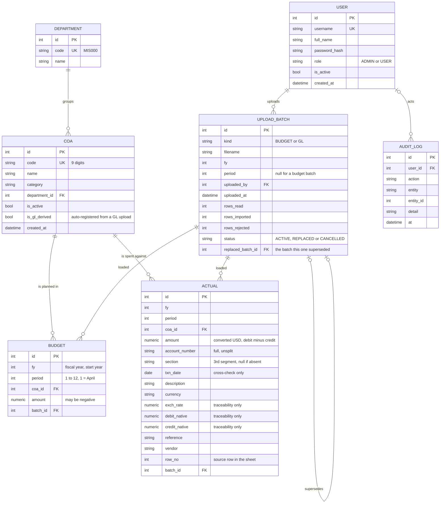

# VEGA — ERD Audit, Final ERD & FRD–ERD Consistency Check

Companion document to `VEGA_FRD.md`. The submitted ERD (`ERD_REVISED.md`) is already an unusually
careful, rationale-heavy model — most of the "normal" ERD-review findings (normalisation, why
`category`/`role`/`fiscal_year` aren't tables, delete behaviour, money typing) are already argued
correctly in the source document. This audit therefore focuses on what's **missing or unresolved**
against the FRD, not on re-litigating decisions the source already justifies well.

---

## 3. ERD Audit Findings

### 3.1 Structural findings (no entity change required)

| # | Finding | Severity | Detail |
|---|---|---|---|
| E-1 | **No entity backs FR-49–FR-53 (backup lifecycle).** `upload_batch` records *when a backup was triggered by a replace* only indirectly (a replace happens "in one transaction" per FR-28), but there is no row anywhere recording a completed backup: its filename, timestamp, trigger (daily/pre-replace/manual), or size — needed for FR-52 ("administrator can list existing backups") and FR-51 ("N is an administrator setting," implying persisted config). | **Medium** | Two legitimate designs exist: (a) backups are pure filesystem artifacts, listed by directory scan (filename encodes timestamp — consistent with FR-50's "unique timestamped name"), with retention count `N` as a config file/env var rather than a DB row; or (b) a lightweight `backup` table records each copy's metadata. The source ERD's own philosophy (§10: "everything installed becomes somebody else's maintenance," deliberately small dependency set) leans toward (a). **This FRD/ERD pass does not add an entity, per your instruction not to add unnecessary ones** — logged as **TBC-8** for the supervisor/client to confirm design (a) explicitly, since it's currently implicit rather than stated. |
| E-2 | **No settings/config entity for FR-51's retention count N.** | **Low** | Same root cause as E-1. If backups are filesystem-only (design (a) above), `N` is almost certainly an environment variable or a config file value, not a database row — consistent with "no separate database server... small dependency set." Flagged, not resolved — **TBC-8** covers this too. |
| E-3 | **`audit_log.action` enum (ERD §2.7) does not include a `BACKUP` action**, even though FR-49 lists "an administrator request" as a backup trigger and FR-54 requires audit logging of data-changing actions. | **Low** | The ERD's own action list (§2.7) actually *does* enumerate `BACKUP` — re-checked directly against the source: `LOGIN, LOGIN_FAILED, UPLOAD, UPLOAD_REFUSED, REPLACE, CANCEL, COA_AUTO_REGISTER, USER_CREATE, USER_UPDATE, BACKUP`. **No gap — finding retracted on re-check**, kept here only so the audit trail shows it was checked. |
| E-4 | **No explicit support for FR-33's "cancel a batch" distinguishing a cancelled *original* batch from a cancelled *replacement* batch**, which matters for the User-Manual warning in FR-33 ("cancelling a batch that already replaced another does not restore the replaced figures"). | **Low** | The ERD's `status` enum (`ACTIVE`/`REPLACED`/`CANCELLED`) plus `replaced_batch_id` self-reference is sufficient to reconstruct this at query time — a cancelled batch whose `replaced_batch_id` is non-null is exactly the scenario the warning describes. No structural gap; this is an application-logic / documentation concern, not a data-model one. |
| E-5 | **Category source mechanism (Open Item #5) is unresolved and the ERD reflects that honestly** — `coa.category` is free text with no validation, no controlled vocabulary, and no documented derivation rule (from the workbook column vs. derived from the code). | **Medium — carried directly from source Open Item #5** | This is a genuine open item, not an ERD defect: the ERD *correctly* models category as a plain attribute (rationale in ERD §4.1 is sound regardless of how the value is populated), but until Open Item #5 is answered, `coa.category` cannot be guaranteed consistent, which affects FR-44/FR-46 dashboard grouping. No entity change proposed — this is a *business rule* answer that's still pending, not a modelling gap. |
| E-6 | **`department` table for a single-department pilot.** FR-10 seeds exactly one department; FR-46 lists "department" as a filter. | **None — correct as-is** | The ERD's own rationale (§2.2) is correct: the entity exists because the GL account number *carries* the section code and the filter compares against it, not because multiple departments are expected soon. Confirmed consistent with scope §4.2 ("no department-management screen"). |
| E-7 | **No FR maps directly to the `role` permission matrix referenced in Use-Case.md §4**, which was not supplied to this review. | **Low, blocked on missing source** | The ERD's two-value `role` check constraint (ADMIN/USER) is consistent with everything *stated* in the FRD, but cannot be verified against the actual matrix. See **TBC-1**. |

### 3.2 Positive findings (confirmed correct — no action needed)

- **Money typing** (`NUMERIC(18,2)` → `Decimal`, never `float`) directly satisfies FR-42 and BR-6's zero-tolerance comparison — confirmed correct and necessary, not over-engineering.
- **`actual` has no unique constraint on business columns**, correctly allowing duplicate legitimate transactions in one month, with idempotency coming from `batch_id` (BR-4) — matches FR-30/BR-14 exactly.
- **Partial unique indexes on `upload_batch`** (active-batch uniqueness, handling `NULL` period for budget batches) correctly implement "at most one active batch per period/year" implied by FR-18/FR-27 without an explicit FR ever stating the constraint mechanics — good defensive modelling, consistent with intent.
- **`coa.is_active` is set by ingestion only, never by hand** — this correctly enforces BR-16/FR-7 at the schema level (no write path exists for a human to flip it).
- **Traceability columns on `actual`** (`account_number`, `section`, `debit_native`, `credit_native`, `exch_rate`, `reference`, `vendor`, `row_no`) map directly and completely to NFR-12; none of them are read by any calculation, matching BR-10.
- **No stored `variance`/`status`/`projection`** correctly implements FR-41 and avoids the staleness risk BR-4 would otherwise create on every re-upload.
- **Replace/cancel delete behaviour** (ERD §7) correctly distinguishes a hard admin delete (cascades) from the normal replace/cancel flow (batch row kept for provenance, child rows removed) — this satisfies FR-32's "history visible to every role" without conflicting with FR-28's atomic replace.

---

## 4. Final ERD

No entity was added or removed relative to the submitted `ERD_REVISED.md` — the audit above found
no case where a missing entity is *required* by a stated FR (as opposed to *implied but
unconfirmed*, which is a business-rule gap, not a modelling one). The Mermaid diagram, entity
list, and relationship list below are the submitted model, unchanged, presented here as the
FRD-audited "final" version for this deliverable, with the constraint recommendations from
`ERD_REVISED.md` §8 called out explicitly as **required**, not optional, since several of them are
the only place several FRs' business rules become enforceable rather than merely documented.

### 4.1 Entity & Attribute List (final)

| Entity | Key attributes | Notes |
|---|---|---|
| `user` | `id` PK, `username` UK, `full_name`, `password_hash`, `role` (`ADMIN`\|`USER`), `is_active`, `created_at` | Deactivated, never deleted (FR-5). |
| `department` | `id` PK, `code` UK (`MIS000`), `name` | Seeded on first run (FR-10). |
| `coa` | `id` PK, `code` UK, `name`, `category`, `department_id` FK, `is_active`, `is_gl_derived`, `created_at` | Never hand-written (FR-7, BR-16); never hard-deleted (FR-9). |
| `budget` | `id` PK, `fy`, `period` (1–12, 1=Apr), `coa_id` FK, `amount` (may be negative), `batch_id` FK | Unique `(fy, period, coa_id)`. |
| `actual` | `id` PK, `fy`, `period`, `coa_id` FK, `amount`, `account_number`, `section` (nullable), `txn_date` (nullable), `description`, `currency`, `exch_rate` (nullable), `debit_native`, `credit_native`, `reference`, `vendor`, `row_no`, `batch_id` FK | Index `(fy, period, coa_id)`; no business-column unique constraint (BR-4 handles idempotency). |
| `upload_batch` | `id` PK, `kind` (`BUDGET`\|`GL`), `filename`, `fy`, `period` (nullable), `uploaded_by` FK, `uploaded_at`, `rows_read`, `rows_imported`, `rows_rejected`, `status` (`ACTIVE`\|`REPLACED`\|`CANCELLED`), `replaced_batch_id` FK (self, nullable) | Partial unique indexes enforce "one active batch per period/year." |
| `audit_log` | `id` PK, `user_id` FK (nullable), `action`, `entity` (nullable), `entity_id` (nullable), `detail` (nullable), `at` | Append-only; `user_id` nullable for scheduler events. |

### 4.2 Relationship List (final)

| From | To | Cardinality | Meaning |
|---|---|---|---|
| `department` | `coa` | 1 — many | A department groups many COA rows. |
| `coa` | `budget` | 1 — many | An account has 12 budget rows per fiscal year. |
| `coa` | `actual` | 1 — many | An account has many GL transaction lines. |
| `upload_batch` | `budget` | 1 — many | A batch loaded these budget rows. |
| `upload_batch` | `actual` | 1 — many | A batch loaded these actual rows. |
| `user` | `upload_batch` | 1 — many | A user uploaded these batches. |
| `user` | `audit_log` | 0/1 — many | A user (or null, for scheduler) performed these actions. |
| `upload_batch` | `upload_batch` (self) | 0/1 — 0/1 | A replacement batch supersedes at most one earlier batch; an earlier batch is superseded by at most one replacement. |

### 4.3 Updated Mermaid ERD

Structurally identical to the submitted diagram — reproduced here as the audited "final" artifact
so this deliverable is self-contained, with no changes needed:

### 4.4 Constraints this ERD requires to actually enforce the FRD (elevated from "recommended" to "required")

These already appear in `ERD_REVISED.md` §8 as recommendations. Cross-checking against the FRD:
each one is the *only* place a specific FR/BR becomes machine-enforced rather than merely
documented, so this audit reclassifies them as **required for acceptance**, not optional polish.

| Constraint | Enforces |
|---|---|
| `CHECK (period BETWEEN 1 AND 12)` on `budget`, `actual` | Implicit in FR-13/FR-22 — a period outside range is not a stated valid case. |
| `CHECK` linking `upload_batch.kind` to nullability of `period` | FR-18 (budget = whole year) vs. FR-19–FR-26 (GL = one period). |
| `CHECK (role IN ('ADMIN','USER'))` | FR-3's two-role model. |
| `CHECK (status IN ('ACTIVE','REPLACED','CANCELLED'))` | FR-27–FR-33, FR-56 (no `REFUSED` status — refusals never reach storage, per BR-14). |
| Partial unique indexes for "one active batch per (kind, fy[, period])" | FR-18, FR-27 — the replace-decision gate only makes sense if "already loaded" is a well-defined, single-row check. |
| `replaced_batch_id <> id`, unique when non-null | Prevents a batch from superseding itself or being superseded twice — protects FR-33's cancellation warning from becoming ambiguous. |

---

## 5. FRD–ERD Consistency Check

| Check | Result |
|---|---|
| Every **entity** required by a Must-have FR has a corresponding table | ✅ Yes — `user`, `department`, `coa`, `budget`, `actual`, `upload_batch`, `audit_log` cover FR-1–FR-33 (excluding backup, see below). |
| Every FR's **input data** has somewhere to land | ✅ Yes, including all traceability-only columns on `actual` (NFR-12). |
| Every **business rule** (BR-1–BR-17) is either enforced by the schema or clearly left to application logic | ⚠️ Mostly. BR-1, BR-4, BR-6 (via type), BR-7, BR-9, BR-10, BR-14, BR-16 are schema-supported or schema-enabled. BR-2, BR-3, BR-8, BR-11, BR-12, BR-13, BR-15, BR-17 are **application-logic rules with no schema representation needed** (correctly — they're about calculation/process order, not storage shape). No rule is unsupported. |
| Every **status/enum** value used by the FRD exists in the ERD's constrained domains | ✅ Yes: `ADMIN`/`USER`; `ACTIVE`/`REPLACED`/`CANCELLED`; `BUDGET`/`GL`. `ALOKASI`/`ON BUDGET`/`OVER BUDGET`/`UNDER BUDGET` are **correctly absent** from the ERD — they're computed labels (FR-41), not stored. |
| FR-49–FR-53 (backup lifecycle) map to a table | ❌ **No** — see E-1/E-2. Not necessarily a defect (filesystem design is plausible and consistent with the project's "small dependency set" philosophy) but it is **unconfirmed**, so flagged as TBC-8 rather than resolved either way. |
| Open Item #5 (category source) is reflected honestly in the ERD | ✅ Yes — `coa.category` is unconstrained text, which is the *correct* modelling choice given the open question, not a bug. |
| Duplicate/conflicting requirements between FRD and ERD | ✅ None found. |
| Any ERD attribute with **no supporting FR** (i.e., ERD invents something the FRD never asked for) | ✅ None found — every column traces to a stated FR, BR, or NFR (traceability columns → NFR-12; `is_gl_derived` → FR-11/FR-24; `replaced_batch_id` → FR-27/FR-33). |
| Any FRD requirement the **current ERD cannot support at all** (a true blocker, not just an open config question) | ✅ None found. Even FR-51/FR-52 (backups) are supportable via filesystem listing without a schema change — they are *unconfirmed*, not *unsupportable*. |

**Overall verdict:** The submitted ERD is consistent with the FRD. No entity is missing that a
Must-have FR *requires* the database to hold. The one open structural question (backup metadata:
DB table vs. filesystem listing) is a design decision still pending confirmation, not a defect —
carried into the TBC list below rather than resolved by assumption, per your instruction.

---

## 6. List of TBC / Pending Decisions

Numbered continuously with the FRD's Audit Findings (Part A) for traceability.

| ID | Item | Blocks / Affects | Source |
|---|---|---|---|
| **TBC-1** | Use-Case.md's permission matrix (§4) was not supplied — the two-role split (FR-3, §5.2 of the FRD) is reconstructed from prose and cannot be verified against the actual matrix. | AC-1 test design | FRD Audit A-6 |
| **TBC-2** | Open Item #1 — where is the detail behind the depreciation budget shown only as a subtotal? | Correct budget for the two auto-registered depreciation accounts | Source §11 Open Item 1 |
| **TBC-3** | Open Item #2 — confirm the unregistered-COA policy. | Whether FR-24 reports or refuses (currently specified as *report*, per FR-24 text — this item asks the client to confirm it's really the intended policy) | Source §11 Open Item 2 |
| **TBC-4** | Open Item #3 — do the two sectionless account numbers belong to IT? | Whether FR-23's department filter needs one clause or two | Source §11 Open Item 3 |
| **TBC-5** | Open Item #4 — which of each duplicate account-code pair is authoritative? | Master-data cleanliness (both pairs currently zero) | Source §11 Open Item 4 |
| **TBC-6** | Open Item #5 — how does a COA map to its category (master list vs. derived from code)? | FR-44/FR-46 dashboard category grouping; `coa.category` population rule | Source §11 Open Item 5 |
| **TBC-7** | Open Item #6 — backup retention count and whether a copy goes to a second location. | FR-51 | Source §11 Open Item 6 |
| **TBC-8** | **New (this review):** is backup metadata (filename, timestamp, trigger, size) tracked in the database, or purely as a filesystem listing with retention `N` as a config value? | FR-49–FR-52; whether a `backup` entity is needed at all | ERD Audit E-1, E-2 |
| **TBC-9** | Open Item #7 — host PC address and local administrator rights. | Deployment | Source §11 Open Item 7 |
| **TBC-9b** | Open Item #8 — one real GL month for AC-8. | AC-8, the acceptance test that matters most; cannot be simulated from sample workbooks (scale mismatch) | Source §11 Open Item 8 |
| **TBC-9c** | Open Item #9 — UI language (English / Indonesian / Indonesian labels over English terms). | Frontend copy, User Manual screenshots | Source §11 Open Item 9 |
| **TBC-10** | **New (this review):** the Administrator's "download templates" capability (§5.2 role table) has no dedicated FR — only implied by FR-34. | Whether FR-34 already covers this or a new FR is needed | FRD Audit A-3 |
| **TBC-11** | **New (this review):** no FR specifies session/token expiry, failed-login lockout, or password complexity. | Auth hardening scope, NFR-8/NFR-9 boundary | FRD Audit A-4 |

**Recommendation:** TBC-6 (category source) and TBC-8 (backup metadata design) are the two items
most likely to change a schema or an FR wording if answered a certain way — raise those two first,
ideally before the Phase 3 checkpoint alongside the CRUD-deviation discussion the source document
already flags (§12).
