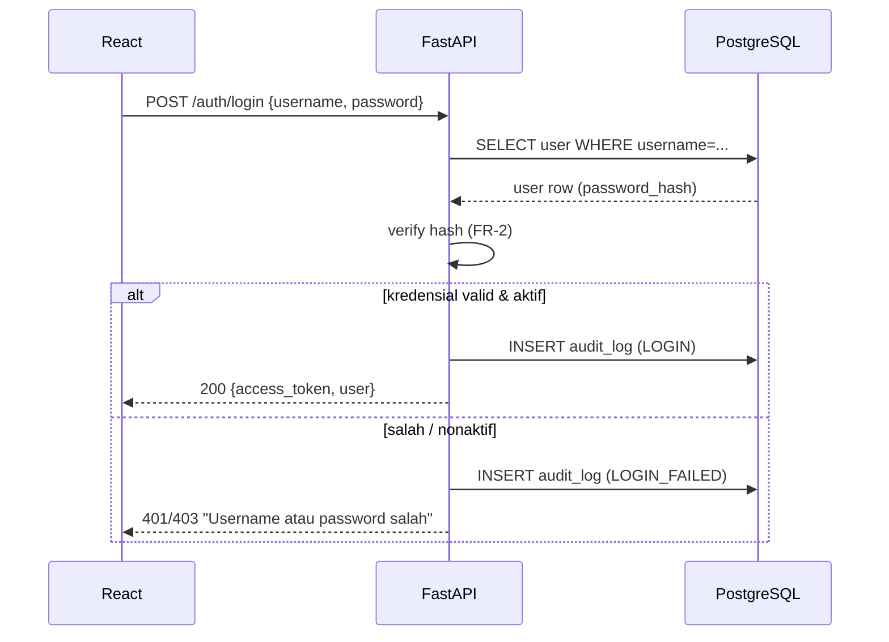
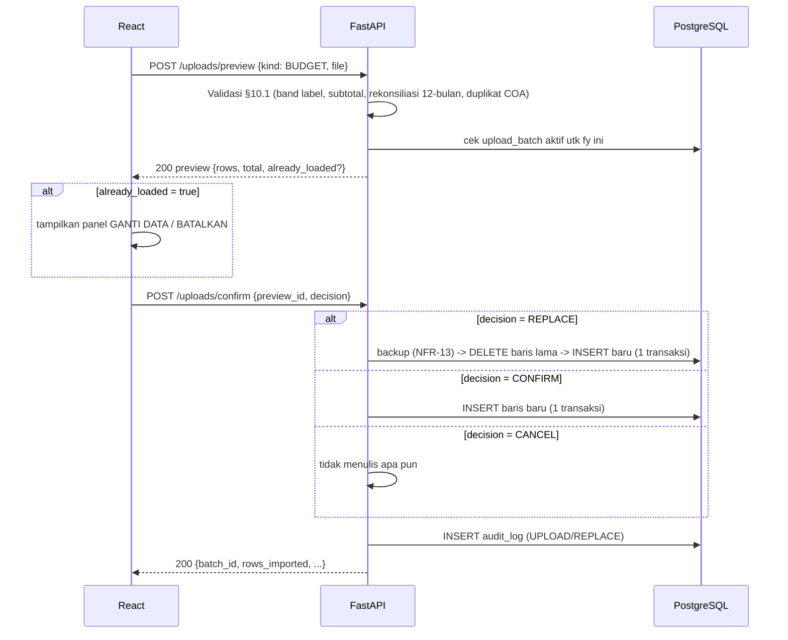
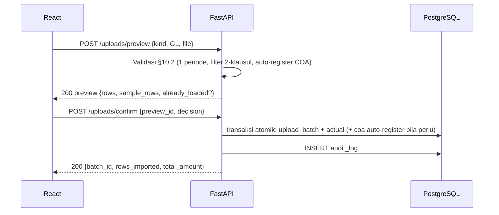
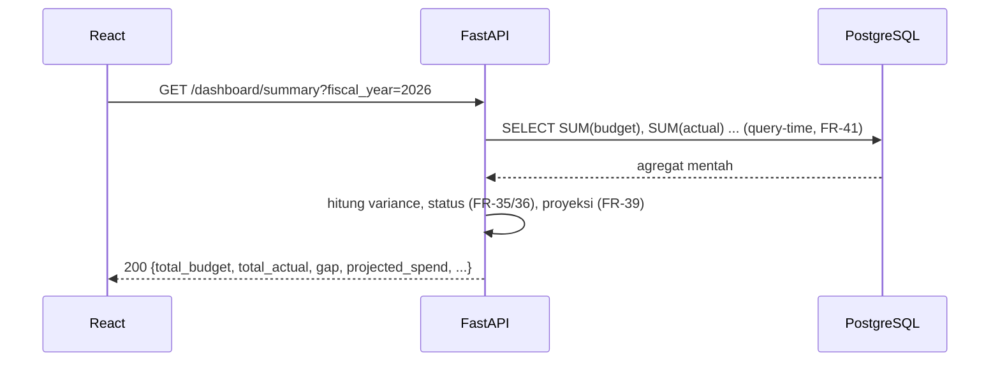
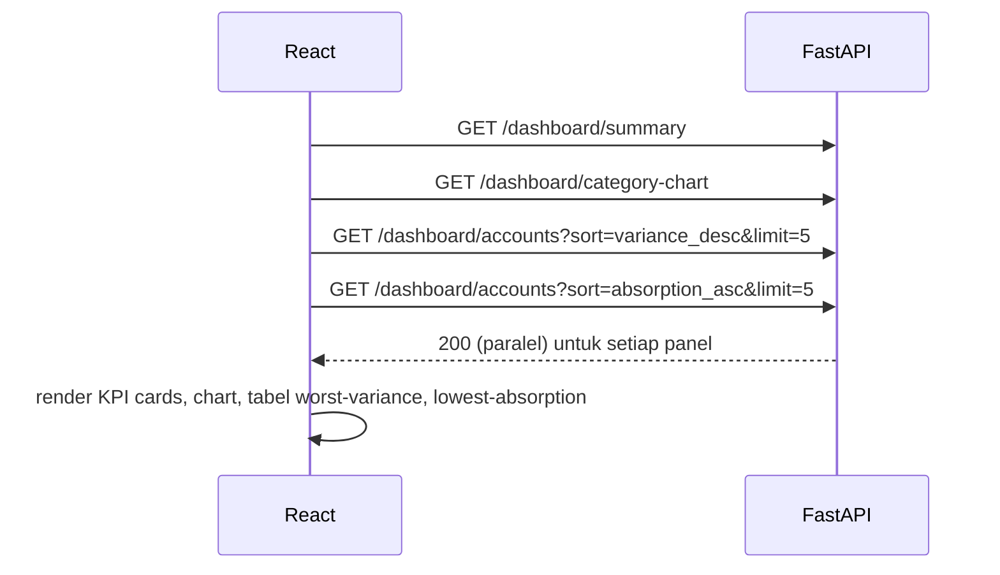

# VEGA — Draft API Contract
### Budget vs Actual / General Ledger Analysis System

| Field | Value |
|---|---|
| Dokumen | Draft API Contract (Frontend React ⇄ Backend FastAPI) |
| Sumber | `VEGA_FRD.md`, `VEGA_ERD.md`, Mockup `01___Login.pdf`, `Budget_Final__2_.xlsx`, `GL_Final__1_.xlsx` |
| Tech stack | Frontend: React · Backend: Python FastAPI · DB: PostgreSQL · API: REST |
| Status | Draft — siap direview SPV/Partner & developer |
| Base path | `/api/v1` |

> **Catatan metodologi:** Endpoint di bawah ini hanya mencakup kebutuhan yang benar-benar didukung oleh FRD/ERD/Mockup/struktur Excel. Tidak ada endpoint yang dibuat semata-mata karena "lazimnya API seperti itu". Setiap poin yang belum jelas ditandai **TBD**, dan setiap kebutuhan yang belum punya entity di ERD ditandai **ERD GAP**.

---

## 1. API Overview

### 1.1 Modul yang dicakup

| Modul | Deskripsi | Sumber FR |
|---|---|---|
| Authentication | Login, logout, profil, ganti password sendiri | FR-1, FR-2, FR-6 |
| User Management | CRUD user & role oleh Administrator | FR-3, FR-4, FR-5 |
| COA (Chart of Account) | Read-only, hasil turunan dari upload | FR-7 – FR-11 |
| Fiscal Year | Daftar tahun anggaran yang tersedia (derivable, bukan tabel tersendiri) | ERD §9 (no fiscal_year entity), BR-2 |
| Upload (Budget & GL) | Preview → konfirmasi/replace → riwayat & audit trail | FR-12 – FR-33, FR-55, FR-56 |
| Calculation | Variance, status, projeksi akhir tahun (query-time only) | FR-35 – FR-42 |
| Dashboard | KPI cards, chart, trend, tabel per-akun, monthly matrix | FR-43 – FR-48 |
| Audit Trail | Log aktivitas yang mengubah data | FR-54 |
| Backup | Trigger & daftar backup (desain belum final — lihat §10) | FR-49 – FR-53 |

### 1.2 Role model

Role adalah **atribut user** dua nilai (`ADMIN` / `USER`), bukan tabel terpisah (ERD §4.2, FR-3).

| Role | Hak akses |
|---|---|
| **ADMIN** (Administrator) | Semua hak USER, plus: upload file, konfirmasi/replace/cancel batch, kelola user & role, download template, trigger/lihat backup, tambah catatan audit |
| **USER** (Regular user) | Read-only murni: dashboard, COA list, upload history/audit trail. Tidak ada endpoint tulis yang bisa diakses — termasuk lewat pemanggilan langsung (FR-3, AC-1) |

Otorisasi diterapkan sebagai **satu dependency terpusat di level route** (bukan pengecekan per-handler, bukan hanya menyembunyikan tombol UI) — FastAPI dependency yang membaca role dari JWT/session dan menolak (403) sebelum handler dijalankan.

### 1.3 Konvensi umum

- Semua request/response body: JSON, kecuali upload file (`multipart/form-data`).
- Semua field uang: dikirim sebagai string atau number presisi tetap (2 desimal), **tidak pernah** dibulatkan di sisi transport — pembulatan hanya terjadi sekali di titik perbandingan status (FR-36, BR-6).
- Semua field tanggal: ISO-8601 (`YYYY-MM-DD`).
- Fiscal year: dikirim sebagai integer tahun mulai (`2026` untuk **FY26** = Apr 2026–Mar 2027), sesuai BR-2. Label tampilan (`FY26`) adalah representasi frontend.
- Period: integer `1–12`, dengan `1 = April` (BR-2).
- Autentikasi: Bearer token (JWT) di header `Authorization`.

---

## 2. Endpoint List

| Module | Method | Endpoint | Purpose | Role |
|---|---|---|---|---|
| Auth | POST | `/api/v1/auth/login` | Login, terbitkan token | Public |
| Auth | POST | `/api/v1/auth/logout` | Invalidasi sesi/token | ADMIN, USER |
| Auth | GET | `/api/v1/auth/me` | Ambil profil user yang sedang login | ADMIN, USER |
| Auth | PUT | `/api/v1/auth/me/password` | Ganti password sendiri | ADMIN, USER |
| User Mgmt | GET | `/api/v1/users` | Daftar user | ADMIN |
| User Mgmt | POST | `/api/v1/users` | Buat user baru | ADMIN |
| User Mgmt | GET | `/api/v1/users/{id}` | Detail user | ADMIN |
| User Mgmt | PUT | `/api/v1/users/{id}` | Ubah nama/role user | ADMIN |
| User Mgmt | PATCH | `/api/v1/users/{id}/status` | Aktifkan/nonaktifkan user | ADMIN |
| User Mgmt | POST | `/api/v1/users/{id}/reset-password` | Reset password user lain | ADMIN |
| COA | GET | `/api/v1/coa` | Daftar/cari COA | ADMIN, USER |
| COA | GET | `/api/v1/coa/{id}` | Detail satu COA | ADMIN, USER |
| Fiscal Year | GET | `/api/v1/fiscal-years` | Daftar tahun anggaran yang punya data | ADMIN, USER |
| Upload | POST | `/api/v1/uploads/preview` | Parse & validasi file, tampilkan preview (belum simpan) | ADMIN |
| Upload | POST | `/api/v1/uploads/confirm` | Konfirmasi simpan / GANTI DATA / BATALKAN | ADMIN |
| Upload | GET | `/api/v1/uploads/batches` | Riwayat upload (semua batch) | ADMIN, USER |
| Upload | GET | `/api/v1/uploads/batches/{id}` | Detail satu batch | ADMIN, USER |
| Upload | POST | `/api/v1/uploads/batches/{id}/cancel` | Batalkan batch yang sudah tersimpan | ADMIN |
| Upload | GET | `/api/v1/uploads/templates/{kind}` | Unduh template Excel standar | ADMIN *(TBD — lihat §10)* |
| Upload | POST | `/api/v1/uploads/batches/{id}/notes` | Tambah catatan audit internal pada batch | ADMIN *(ERD GAP — lihat §10)* |
| Calculation/Dashboard | GET | `/api/v1/dashboard/summary` | KPI cards (budget, actual, selisih, proyeksi) | ADMIN, USER |
| Calculation/Dashboard | GET | `/api/v1/dashboard/category-chart` | Budget vs Actual per kategori COA | ADMIN, USER *(TBD — lihat §10)* |
| Calculation/Dashboard | GET | `/api/v1/dashboard/trend` | Trend kuartalan dalam satu fiscal year | ADMIN, USER |
| Calculation/Dashboard | GET | `/api/v1/dashboard/accounts` | Tabel per-akun: budget/actual/variance/status | ADMIN, USER |
| Calculation/Dashboard | GET | `/api/v1/dashboard/monthly-matrix` | Matriks bulanan per akun (Apr–Mar + Total YTD) | ADMIN, USER |
| Calculation/Dashboard | GET | `/api/v1/dashboard/export` | Export tabel ke Excel/CSV | ADMIN, USER *(TBD, FR-48 Could-have)* |
| Audit Trail | GET | `/api/v1/audit-log` | Daftar log audit (login, upload, replace, dll.) | ADMIN |
| Backup | POST | `/api/v1/backups` | Trigger backup manual | ADMIN *(TBD — lihat §10)* |
| Backup | GET | `/api/v1/backups` | Daftar backup yang ada | ADMIN *(TBD — lihat §10)* |

---

## 3. Endpoint Details

### 3.1 Authentication

#### `POST /api/v1/auth/login`
| | |
|---|---|
| Purpose | Autentikasi user, terbitkan token sesi |
| Role | Public |
| Auth | Tidak perlu token |

**Request body**
```json
{ "username": "it.admin@company.com", "password": "••••••••••" }
```
**Response 200**
```json
{
  "success": true,
  "message": "Success",
  "data": {
    "access_token": "eyJhbGciOi...",
    "token_type": "bearer",
    "user": { "id": 1, "username": "it.admin@company.com", "full_name": "Budi Santoso", "role": "ADMIN" }
  }
}
```
**Validation/Error**
- `401` — username/password salah. Pesan mengikuti mockup: *"Username atau password salah."*
- `403` — akun `is_active = false` (FR-5).
- Login sukses/gagal dicatat ke `audit_log` (`LOGIN` / `LOGIN_FAILED`) — FR-54.
- **TBD** — lockout setelah N kali gagal, dan durasi expiry token belum ditentukan (TBC-11, tidak ada FR yang mengaturnya).

#### `POST /api/v1/auth/logout`
Menghapus/invalidasi sesi sisi server (jika session-based) atau hanya instruksi ke klien untuk membuang token (jika stateless JWT — **TBD**, tergantung skema token yang dipilih backend).
**Response 200** — `{ "success": true, "message": "Success", "data": {} }`

#### `GET /api/v1/auth/me`
**Response 200**
```json
{ "success": true, "message": "Success", "data": { "id": 1, "username": "it.admin@company.com", "full_name": "Budi Santoso", "role": "ADMIN", "is_active": true } }
```

#### `PUT /api/v1/auth/me/password` (FR-6)
**Request body**
```json
{ "old_password": "••••••••••", "new_password": "••••••••••••" }
```
**Response 200** — `{ "success": true, "message": "Password updated", "data": {} }`
**Validation**: `old_password` harus cocok (verifikasi hash — FR-2) sebelum `new_password` disimpan. `422` jika `old_password` salah atau `new_password` tidak memenuhi aturan (aturan kompleksitas password: **TBD**, TBC-11).

---

### 3.2 User Management (FR-4, FR-5) — Admin only

#### `GET /api/v1/users`
Query params: `search`, `role`, `is_active`, `page`, `page_size`.
**Response 200**
```json
{
  "success": true, "message": "Success",
  "data": {
    "items": [
      { "id": 1, "username": "budi.santoso", "full_name": "Budi Santoso", "role": "ADMIN", "is_active": true, "created_at": "2026-01-10T09:00:00Z" }
    ],
    "total": 4, "page": 1, "page_size": 20
  }
}
```

#### `POST /api/v1/users`
**Request body**
```json
{ "username": "siti.rahma", "full_name": "Siti Rahmawati", "password": "••••••••••••", "role": "USER" }
```
**Response 201** — data user yang dibuat (tanpa `password_hash`).
**Validation**: `username` unik (`409` jika duplikat); `role` harus salah satu `ADMIN`/`USER` (`422` jika di luar itu — CHECK constraint ERD §4.4).

#### `GET /api/v1/users/{id}` — detail user, `404` jika tidak ditemukan.

#### `PUT /api/v1/users/{id}` (FR-4)
**Request body**
```json
{ "full_name": "Budi Santoso", "role": "Administrator" }
```
> Catatan: mockup menampilkan label "Administrator" di dropdown Peran Akses — mapping ke value ERD `ADMIN`/`USER` dilakukan di frontend atau di lapisan serializer.

#### `PATCH /api/v1/users/{id}/status` (FR-5)
**Request body**
```json
{ "is_active": false }
```
**Business rule**: user yang dinonaktifkan tidak bisa login (FR-1 diblokir), tapi riwayat upload/audit tetap terhubung ke user tersebut (tidak pernah dihapus — ERD §2.1).

#### `POST /api/v1/users/{id}/reset-password` (FR-4, sesuai mockup tombol "Reset Password")
**Response 200** — `{ "success": true, "message": "Reset link sent", "data": {} }`
**TBD**: mekanisme reset (kirim link/email vs generate password sementara) tidak dijelaskan di FRD — perlu konfirmasi.

---

### 3.3 COA (FR-7 – FR-11) — Read-only

#### `GET /api/v1/coa`
Query params: `search` (kode/nama akun), `category`, `department`, `is_active`, `is_gl_derived`, `page`, `page_size`.
**Response 200**
```json
{
  "success": true, "message": "Success",
  "data": {
    "items": [
      { "id": 12, "code": "52301", "name": "Lisensi Software", "category": "Perangkat Lunak", "department": "IT - Teknologi Informasi", "source": "Excel Core", "is_active": true, "is_gl_derived": false }
    ],
    "total": 6, "page": 1, "page_size": 50
  }
}
```
**Catatan**: kolom `Sistem Register` pada mockup (`Excel Core` / `Auto`) = representasi `is_gl_derived` (FR-11): `false` → "Excel Core", `true` → "Auto".
**Tidak ada** `POST/PUT/DELETE` — sesuai BR-16, satu-satunya cara koreksi adalah re-upload file sumber.

#### `GET /api/v1/coa/{id}` — detail satu akun.

---

### 3.4 Fiscal Year

#### `GET /api/v1/fiscal-years`
Tidak ada tabel `fiscal_year` di ERD (by design — FRD §9). Endpoint ini **derive** daftar tahun anggaran dari nilai `fy` yang sudah pernah di-upload (`DISTINCT fy` dari `upload_batch`/`budget`).
**Response 200**
```json
{ "success": true, "message": "Success", "data": [ { "fy": 2026, "label": "FY26" }, { "fy": 2025, "label": "FY25" } ] }
```
**Status: READY** (secara teknis) meski tidak disebut eksplisit sebagai FR tersendiri — dibutuhkan agar dropdown "Tahun Anggaran" di mockup punya sumber data yang valid tanpa hardcode di frontend.

---

### 3.5 Upload Lifecycle (FR-12 – FR-33, FR-55, FR-56)

Alur dua langkah wajib (BR-17): **Preview → Confirm**, dengan langkah tambahan **Replace decision** hanya jika periode/FY sudah ada data aktif (FR-27).

#### `POST /api/v1/uploads/preview` (FR-55)
| | |
|---|---|
| Purpose | Parse file di memori, validasi penuh, TIDAK menulis apa pun ke database (BR-17) |
| Role | ADMIN |
| Content-Type | `multipart/form-data` |

**Request**
```
kind: "BUDGET" | "GL"
file: <binary xlsx>
```
**Process**
- `kind = BUDGET` → jalankan aturan §10.1 (band label, subtotal-by-description, rekonsiliasi 12 bulan vs total tahunan toleransi 0.005, duplikat COA, negatif diterima).
- `kind = GL` → jalankan aturan §10.2 (satu sheet CORE, satu periode fiskal per file, filter 2-klausul departemen, COA tak terdaftar auto-register).

**Response 200 — file diterima (untuk preview)**
```json
{
  "success": true,
  "message": "Success",
  "data": {
    "preview_id": "b7a1f8b2-...",
    "kind": "GL",
    "sheet_read": "CORE",
    "fiscal_year": 2026,
    "period": 6,
    "period_label": "Jun 2026",
    "total_rows_read": 47,
    "rows_accepted": 45,
    "rows_rejected": 2,
    "total_amount": 460000000,
    "sample_rows": [
      { "coa": "52301", "description": "Lisensi Cloud Core v3", "date": "2026-06-14", "amount": 340000000, "status": "Diterima, COA valid" },
      { "coa": "99999", "description": "Biaya Operasional Gelap", "date": "2026-06-22", "amount": 2000000, "status": "Ditolak: Kode Akun Tidak Terdaftar" }
    ],
    "already_loaded": {
      "exists": true,
      "existing_batch": { "id": 88, "filename": "GL_Juni_2026.xlsx", "rows": 42, "total_amount": 438000000, "uploaded_by": "Budi Santoso", "uploaded_at": "2026-07-15T10:32:00Z" }
    }
  }
}
```
> `already_loaded.exists = true` → frontend menampilkan panel **GANTI DATA / BATALKAN** (FR-27) sebelum memanggil `confirm`.

**Response 200 — file ditolak (whole-file refusal)**
```json
{
  "success": false,
  "message": "File ditolak — tidak ada data yang disimpan. Data sebelumnya tidak berubah.",
  "data": { "preview_id": null },
  "errors": [
    { "row": 12, "issue": "Kode akun 99999 tidak terdaftar", "expected": "Kode COA yang valid" },
    { "row": 24, "issue": "Nilai nominal kosong", "expected": "Angka positif" },
    { "row": 31, "issue": "Format tanggal tidak dikenali: 14/06/2026", "expected": "Format DD-MMM-YYYY" },
    { "row": 45, "issue": "Kolom Account Number tidak ditemukan", "expected": "Header sesuai template" }
  ]
}
```
> Catatan implementasi: contoh baris 12 di atas ("kode akun 99999") merupakan skenario file-level refusal ilustratif dari mockup halaman error. Sesuai FR-24/BR-12, pada **jalur normal** kode akun yang tidak terdaftar **tidak** membuat file ditolak — melainkan auto-register dengan budget nol dan dilaporkan (lihat contoh `sample_rows` di atas, baris COA `99999` berstatus "Ditolak" hanya jika COA gagal register scenario tertentu, bukan aturan umum). **TBD**: perlu klarifikasi mockup vs FR-24 — apakah kasus di layar "Daftar Kesalahan Validasi File" itu representasi pelanggaran lain (mis. format), bukan COA tak terdaftar.

**HTTP Status**: selalu `200` untuk hasil preview (baik diterima maupun ditolak) karena ini bukan error transport — hasil validasi ada di body. `400` hanya untuk file yang secara fisik tidak bisa dibuka/bukan xlsx (NFR-8).

#### `POST /api/v1/uploads/confirm` (FR-27 – FR-30, FR-56)
**Request body**
```json
{ "preview_id": "b7a1f8b2-...", "decision": "CONFIRM" }
```
`decision` ∈ `CONFIRM` (tidak ada data lama — commit langsung), `REPLACE` (= tombol **GANTI DATA**, FR-28), `CANCEL` (= tombol **BATALKAN**, FR-29 — tidak menulis apa pun).

**Response 200 — sukses simpan**
```json
{
  "success": true,
  "message": "Data GL Juni 2026 berhasil disimpan.",
  "data": {
    "batch_id": 101,
    "rows_read": 47,
    "rows_imported": 45,
    "rows_rejected": 2,
    "period_label": "Jun 2026",
    "total_amount": 460000000
  }
}
```
**Response 200 — CANCEL**
```json
{ "success": true, "message": "Pratinjau dibatalkan — tidak ada data yang disimpan.", "data": {} }
```
**Business rules**
- `REPLACE` → backup diambil dahulu (NFR-13), lalu hapus baris periode lama + insert baru **dalam satu transaksi** (FR-28, atomik).
- Seluruh proses commit atomik: sukses total atau gagal total (FR-30, BR-14).
- `preview_id` kedaluwarsa setelah dipakai atau setelah timeout tertentu — **TBD** (durasi belum diatur di FRD).
- Setiap commit dicatat ke `audit_log` (`UPLOAD` / `REPLACE`) — FR-54.

**Error**
- `409` — `preview_id` valid tetapi `decision = CONFIRM` dikirim padahal `already_loaded.exists = true` (klien seharusnya mengirim `REPLACE`/`CANCEL`, bukan `CONFIRM`) → gate FR-27 dilanggar di sisi klien.
- `410` — `preview_id` tidak ditemukan/kedaluwarsa → klien harus preview ulang.

#### `GET /api/v1/uploads/batches` (FR-32)
Query: `kind`, `fiscal_year`, `status`, `page`, `page_size`. Terlihat oleh semua role (read-only untuk USER).
**Response 200**
```json
{
  "success": true, "message": "Success",
  "data": {
    "items": [
      { "id": 101, "kind": "GL", "filename": "GL_Juni_2026.xlsx", "fiscal_year": 2026, "period": 6, "uploaded_by": "Budi Santoso", "uploaded_at": "2026-07-15T10:32:00Z", "rows_imported": 45, "status": "ACTIVE" },
      { "id": 88, "kind": "GL", "filename": "GL_Juni_2026_v1.xlsx", "fiscal_year": 2026, "period": 6, "uploaded_by": "Budi Santoso", "uploaded_at": "2026-07-14T09:12:00Z", "rows_imported": 42, "status": "REPLACED", "replaced_by_batch_id": 101 }
    ],
    "total": 5, "page": 1, "page_size": 20
  }
}
```

#### `GET /api/v1/uploads/batches/{id}`
Detail satu batch + relasi `replaced_batch_id` (untuk menampilkan panel "Versi Terkait / Versi Aktif" di mockup Audit Trail).

#### `POST /api/v1/uploads/batches/{id}/cancel` (FR-33)
**Response 200** — status batch berubah jadi `CANCELLED`, baris anak (`budget`/`actual`) di batch tsb dihapus.
**Peringatan** (didokumentasikan, bukan validasi sistem): membatalkan batch yang sebelumnya sudah menggantikan batch lain **tidak** mengembalikan data yang tergantikan (FR-33 note).

#### `GET /api/v1/uploads/templates/{kind}` — **Status: TBD** (lihat §10, TBC-10)
`kind` = `BUDGET` | `GL`. Mengunduh file Excel template kosong, dibuat dari konstanta layout yang sama dengan parser (NFR-15). FR-34 menyebut sistem "menghasilkan" template, tetapi tidak menyebut siapa yang trigger dan bagaimana cara expose-nya (download endpoint vs static file) — perlu konfirmasi sebelum difinalisasi.

#### `POST /api/v1/uploads/batches/{id}/notes` — **Status: ERD GAP** (lihat §10)
Merepresentasikan tombol "Tambah Catatan" pada mockup Audit Trail ("Catatan Audit Internal (Append-Only)"). **Tidak ada aksi ini di enum `audit_log.action`** pada ERD (`LOGIN, LOGIN_FAILED, UPLOAD, UPLOAD_REFUSED, REPLACE, CANCEL, COA_AUTO_REGISTER, USER_CREATE, USER_UPDATE, BACKUP`). Perlu review ERD untuk menambah nilai enum (mis. `NOTE`) sebelum endpoint ini bisa diimplementasikan sesuai model saat ini.

---

### 3.6 Calculation & Dashboard (FR-35 – FR-48)

Semua nilai `variance`, `status`, `projection` dihitung **saat query**, tidak pernah disimpan (FR-41) — lihat rumus lengkap di §5.

#### `GET /api/v1/dashboard/summary` (FR-43, FR-39, FR-40)
Query: `fiscal_year` (wajib), `quarter`, `category`, `department`.
**Response 200**
```json
{
  "success": true, "message": "Success",
  "data": {
    "total_budget": 4800000000,
    "total_actual": 1400000000,
    "gap": 570000000,
    "gap_status": "UNDER_BUDGET",
    "gap_pct": 11.9,
    "months_loaded": 3,
    "projected_spend": 5500000000,
    "projected_gap": -720000000,
    "projected_gap_pct": -15.0,
    "projected_status": "OVER_BUDGET",
    "remaining_budget": 3400000000,
    "allowed_avg_monthly_spend": 380000000,
    "system_status_note": "Menampilkan FY26 - data sampai Jun 2026. GL Juli belum diunggah."
  }
}
```
`gap` = total variance (FR-35). `gap_status`/`projected_status` mengikuti aturan zero-tolerance (FR-36) untuk agregat, dijelaskan lengkap di §5.

#### `GET /api/v1/dashboard/category-chart` — **Status: TBD** (FR-44)
Query: `fiscal_year`, `period`/`quarter`, `department`.
**Response 200**
```json
{
  "success": true, "message": "Success",
  "data": [
    { "category": "Perangkat Lunak", "budget": 800000000, "actual": 920000000, "variance_pct": -16.6 },
    { "category": "Jaringan", "budget": 350000000, "actual": 168000000, "variance_pct": 54.3 }
  ]
}
```
**Blocked oleh TBC-6** (Open Item #5): cara `coa.category` diisi (master list vs derivasi dari kode) belum final — nilai kategori pada respons ini bergantung pada keputusan tsb.

#### `GET /api/v1/dashboard/trend` (FR-45)
Query: `fiscal_year`, `category`, `department`.
**Response 200**
```json
{
  "success": true, "message": "Success",
  "data": [
    { "quarter": "Q1", "periods": [1,2,3], "budget": 1200000000, "actual": 1400000000 }
  ]
}
```
Fiscal Q1 = periode 1–3 (Apr–Jun), sesuai ERD §3.

#### `GET /api/v1/dashboard/accounts` (FR-47)
Query: `fiscal_year` (wajib), `quarter`, `category`, `department`, `sort` (`variance_desc` | `absorption_asc` | `code_asc`, dst.), `limit`.
**Response 200**
```json
{
  "success": true, "message": "Success",
  "data": [
    {
      "code": "52301", "name": "Lisensi Software", "category": "Perangkat Lunak",
      "budget": 800000000, "actual": 920000000, "variance": -120000000, "variance_pct": -15.0,
      "status": "OVER_BUDGET", "is_gl_derived": false
    }
  ]
}
```
**Catatan**: widget "Realisasi COA Terburuk" dan "Penyerapan Terendah" pada mockup **bukan endpoint terpisah** — keduanya adalah panggilan endpoint ini dengan `sort` dan `limit` berbeda (`sort=variance_desc&limit=5` dan `sort=absorption_asc&limit=5`). Akun `ALOKASI` (budget bulanan negatif) tetap muncul di respons dengan `status = "ALOKASI"`, dikecualikan dari hitungan over/under (FR-37) tetapi tetap berkontribusi ke `total_budget`/`total_actual` di §3.6 `summary`.

#### `GET /api/v1/dashboard/monthly-matrix` (mengacu ke FR-35–FR-41, mockup "Monthly Performance Matrix")
Query: `fiscal_year` (wajib), `category`, `department`.
**Response 200**
```json
{
  "success": true, "message": "Success",
  "data": [
    {
      "code": "52301", "name": "Lisensi Software",
      "months": { "Apr": 80000000, "May": 120000000, "Jun": 100000000, "Jul": null, "Aug": null, "Sep": null, "Oct": null, "Nov": null, "Dec": null, "Jan": null, "Feb": null, "Mar": null },
      "total_ytd": 300000000
    }
  ]
}
```
`null` merepresentasikan bulan yang belum ada data GL (ditampilkan "–" di mockup), dibedakan dari `0` (bulan sudah diupload dengan nilai nol).

#### `GET /api/v1/dashboard/export` — **Status: TBD** (FR-48, priority Could-have)
Tidak diwajibkan untuk pilot acceptance (tidak direferensikan AC manapun). Format (`xlsx`/`csv`), scope kolom, dan endpoint semantics (sync download vs job async) belum ditentukan.

---

### 3.7 Audit Trail (FR-54)

#### `GET /api/v1/audit-log`
Query: `user_id`, `action`, `entity`, `entity_id`, `date_from`, `date_to`, `page`, `page_size`.
**Response 200**
```json
{
  "success": true, "message": "Success",
  "data": {
    "items": [
      { "id": 501, "user": "Budi Santoso", "action": "UPLOAD", "entity": "upload_batch", "entity_id": 101, "detail": "GL Juni 2026, 45 baris", "at": "2026-07-15T10:32:00Z" }
    ],
    "total": 120, "page": 1, "page_size": 20
  }
}
```
`action` dibatasi pada enum ERD: `LOGIN, LOGIN_FAILED, UPLOAD, UPLOAD_REFUSED, REPLACE, CANCEL, COA_AUTO_REGISTER, USER_CREATE, USER_UPDATE, BACKUP`.

---

### 3.8 Backup — **Status: TBD** (lihat §10, TBC-8)

#### `POST /api/v1/backups` (FR-49, trigger manual)
#### `GET /api/v1/backups` (FR-52)

Desain data backup (tabel `backup` di database vs listing filesystem murni + `N` sebagai config) belum diputuskan di ERD (TBC-8). Kontrak response di bawah ini **indikatif**, menunggu keputusan desain:
```json
{
  "success": true, "message": "Success",
  "data": [ { "filename": "vega_backup_2026-07-15_103200.bak", "trigger": "PRE_REPLACE", "taken_at": "2026-07-15T10:32:00Z", "size_bytes": 10485760 } ]
}
```

---

## 4. Excel Upload Specification

Berdasarkan pemeriksaan langsung terhadap `Budget_Final__2_.xlsx` (sheet `BUDGET_UPLOAD`) dan `GL_Final__1_.xlsx` (sheet `GL_UPLOAD`). **Nama kolom tidak diubah** dari file sumber.

### 4.1 Budget Excel — sheet `BUDGET_UPLOAD`

| Kolom (nama asli) | Wajib? | Tipe data | Format | Validasi | Dipetakan ke |
|---|---|---|---|---|---|
| `Fiscal Year` | Ya | string | `FYxx` (mis. `FY26`) | Harus selaras kalender Apr–Mar (BR-2) | `budget.fy` (integer tahun mulai) |
| `Department` | Ya | string | fixed `"IT"` | **TBD** — tidak ada kolom Department di sumber asli; nilai `"IT"` adalah asumsi sistem, perlu konfirmasi kesejajarannya dengan section `MIS000` di GL | `coa.department_id` |
| `COA` | Ya | string numerik | 9 digit | Harus terdaftar di `COA_MAPPING`; duplikat dalam satu sheet → **hanya kemunculan pertama** yang dimuat, kemunculan kedua dilaporkan `"DUPLICATE - NOT LOADED"`, bukan ditolak (FR-17) | `coa.code` / `budget.coa_id` |
| `Category` | Ya | string | `Direct` / `Indirect` / `SGA` | **TBD** — diturunkan dari prefiks `Description`, aturan ini adalah *convenience rule* sistem, belum menjadi bagian scope yang dikonfirmasi (TBC-6) | `coa.category` |
| `Budget Amount` | Ya | numeric | desimal, separator `.` | Wajib angka; **negatif valid** (bukan alasan penolakan — FR-16), setiap baris per akun harus rekonsiliasi ke total tahunan dengan toleransi 0.005 (FR-15) | `budget.amount` |
| `Period/Month` | Ya | string | `Mon YYYY` (mis. `Apr 2026`) | Harus salah satu dari 12 bulan FY terkait; band-label pada baris di atas kolom bulan yang menentukan lokasi blok, bukan posisi/nama kolom (FR-13) | `budget.period` (1–12, 1=Apr) |
| `Description` | Ya | string | teks bebas | Dicek **sebelum** kolom COA untuk menentukan baris subtotal yang harus dikecualikan (FR-14): baris dengan `Description` mengandung `"TOTAL"` dikecualikan meski `COA`-nya tampak seperti kode valid | traceability / dasar derivasi `Category` |
| `Source Row (RAW_SOURCE)` | Tidak (helper) | integer | — | Hanya untuk traceability ke sheet asal; **tidak dipetakan ke kolom manapun di ERD saat ini** — lihat §10 | — |
| `Validation Status` | Tidak (output) | string | `OK` / `DUPLICATE - NOT LOADED` / dll. | Dihasilkan oleh parser, bukan input | ditampilkan di `sample_rows` hasil preview |

**Field terkait Fiscal Year**: `Fiscal Year`, `Period/Month`.
**Field terkait Account/COA**: `COA`, `Category`, `Description`.
**Potensi duplikat/invalid**: duplikat `COA` dalam satu sheet (dilaporkan, tidak ditolak — FR-17); baris subtotal (dikecualikan by design — FR-14); ketidaksesuaian rekonsiliasi 12-bulan vs total tahunan (menolak **seluruh file** — FR-15).
**Business rule tambahan dari README sumber**: 241 dari 243 baris kandidat adalah item budget valid; 2 baris duplikat COA (`740199001`, `761001000`) — otoritas mana yang benar masih **TBD**, menunggu konfirmasi Finance.

### 4.2 GL Excel — sheet `GL_UPLOAD`

| Kolom (nama asli) | Wajib? | Tipe data | Format | Validasi | Dipetakan ke |
|---|---|---|---|---|---|
| `Account Number` | Ya | string | `<COA 9 digit>-<Site>-<Section opsional>` | Harus mengandung minimal satu `-`; 100% baris sumber mengikuti pola ini | sumber parsing `coa.code` + `actual.section` |
| `COA` | Ya (derivasi) | string numerik | 9 digit | Segmen sebelum `-` pertama pada `Account Number`; jika belum ada di master → auto-register dengan budget nol, dilaporkan bukan ditolak (FR-24, BR-12) | `actual.coa_id` |
| `Department` | Ya (derivasi) | string | — | Hasil filter 2-klausul (BR-11): (a) segmen ke-3 = `MIS000`, ATAU (b) tidak ada segmen ke-3 DAN `COA` sudah ada di master Budget. Baris yang lolos klausul (b) dilaporkan `"included, section missing"` dan `actual.section = null` | scope filter — bukan kolom tersimpan langsung |
| `Nominal (Actual Amount)` | Ya | numeric | desimal | = `Debit (Converted) − Credit (Converted)` (FR-20/FR-21); nilai negatif valid (baris kredit/reversal) | `actual.amount` |
| `Date` | Ya | date | tanggal kalender valid | Hanya **cross-check**, tidak menentukan periode (BR-9); ketidaksesuaian dengan `Pd. (Source Period)` dilaporkan, periode kolom yang menang | `actual.txn_date` |
| `Category` | Ya | string | `Direct` / `Indirect` / `SGA` / `Needs Confirmation` | **TBD** — diturunkan dari sufiks `Account Description`; ~35% baris sumber tidak punya sufiks yang cocok (TBC-6) | `coa.category` |
| `Account Description` | Ya | string | teks bebas | — | `actual.description` / referensi nama `coa.name` |
| `Currency` | Kondisional | string | `IDR` / `USD` / `JPY` | 1 baris sumber tanpa currency — penanganannya **TBD** | `actual.currency` (traceability only, BR-10) |
| `Source Sheet` | Tidak (helper) | string | `CORE` | Hanya `CORE` yang dalam scope MVP; sheet lain (`EMC`,`IAB`,`OCBID`) di luar scope | — |
| `Section Code (Acc# Segment 3)` | Ya (derivasi) | string | mis. `MIS000` | Dipakai di filter 2-klausul BR-11 | `actual.section` |
| `Pd. (Source Period)` | Ya | string | `"01"`–`"12"` | **Sumber kebenaran periode** (BR-9) — bukan `Date`; file dengan >1 periode berbeda ditolak seluruhnya (FR-25) | `actual.period` |
| `Debit (Local)` / `Credit (Local)` | Tidak (traceability) | numeric | — | Tidak pernah dipakai dalam perhitungan apa pun (BR-10) | `actual.debit_native` / `actual.credit_native` |
| `Debit (Converted)` / `Credit (Converted)` | Ya (untuk kalkulasi) | numeric | — | Satu-satunya pasangan yang dipakai untuk menghitung `Nominal (Actual Amount)` (FR-20) | dipakai untuk hitung `actual.amount`; nilai kurs disimpan di `actual.exch_rate` untuk rekonstruksi |
| `Nominal (Local Ccy Net)` | Tidak (alternatif tidak dipakai) | numeric | — | Opsi alternatif untuk `Actual Amount` yang **tidak** dipilih sebagai default (README GL menyebut ini masih perlu konfirmasi Finance) | tidak dipetakan ke kolom ERD terpisah |
| `Validation Status` | Tidak (output) | string | — | Dihasilkan parser | ditampilkan di `sample_rows` hasil preview |

**Field terkait Fiscal Year**: **TBD** — tidak ada kolom `Fiscal Year` eksplisit di `GL_UPLOAD`; fiscal year harus diturunkan dari `Pd. (Source Period)` + `Date` melalui modul kalender fiskal terpusat (BR-2, NFR-15). Ini perlu dikonfirmasi ke tim/dosen pembimbing sebagai bagian dari finalisasi parser.
**Field terkait Account/COA**: `Account Number`, `COA`, `Category`, `Account Description`.
**Potensi duplikat/invalid**: baris dengan akun tidak terdaftar (auto-register, bukan ditolak — FR-24); baris di luar scope departemen (dikecualikan, bukan error — BR-11); file dengan >1 periode fiskal (ditolak seluruhnya — FR-25); baris dengan debit **dan** kredit terisi bersamaan pada baris yang sama (ditolak seluruh file — FR-26); jumlah non-numerik (ditolak seluruh file — FR-26); baris tanpa nomor akun atau tanpa periode (baris tersebut di-skip, bukan menolak seluruh file — FR-26).

### 4.3 Urutan evaluasi validasi (tidak boleh diubah urutannya)

**Budget** (FR-13 → FR-17, lihat FRD §10.1): band-label lokasi blok bulanan → subtotal dikecualikan by description → duplikat COA dilaporkan → rekonsiliasi 12-bulan vs tahunan (toleransi 0.005, gagal = tolak seluruh file) → negatif tidak pernah jadi alasan tolak.

**GL** (FR-25 → FR-26, lihat FRD §10.2): >1 periode fiskal → tolak seluruh file · per baris: akun kosong → skip baris · periode kosong → skip baris · jumlah non-numerik → tolak seluruh file · debit & kredit terisi bersamaan → tolak seluruh file · filter departemen 2-klausul → sertakan/kecualikan · COA tak terdaftar → auto-register & laporkan · selain itu → dimuat.

---

## 5. Calculation API

Semua rumus berikut dihitung **hanya saat query** (FR-41) — tidak pernah disimpan sebagai kolom, agar tidak pernah basi setelah re-upload.

| Rumus | Definisi | Sumber |
|---|---|---|
| Variance | `variance = budget − actual` (per akun per bulan, diagregasi per periode/FY) | FR-35 |
| Status (zero-tolerance) | Pembulatan 2 desimal **sekali**, tepat sebelum perbandingan. `variance ≠ 0` → `UNDER_BUDGET` (variance > 0) atau `OVER_BUDGET` (variance < 0). `variance = 0` tepat → `ON_TRACK`. **Tidak ada** ambang persentase — perbandingan biner. | FR-36, BR-6 |
| Status ALOKASI | Jika budget bulanan **negatif**: status = `ALOKASI`, dikecualikan dari perhitungan over/under & dari hitungan jumlah akun over-budget, tetapi tetap masuk ke total KPI cards | FR-37, BR-7 |
| Variance % | `variance_pct = variance / abs(monthly_budget) × 100`, hanya jika `monthly_budget ≠ 0`. Jika `monthly_budget = 0` → tampilkan `"—"` (bukan `0%`, bukan error) | FR-38 |
| Proyeksi akhir tahun | `projection = actual_to_date / months_loaded × 12`. `months_loaded` = jumlah periode **berbeda yang benar-benar memiliki data GL** — bukan jumlah bulan kalender yang telah lewat | FR-39, BR-8 |
| Sisa budget & rata-rata bulanan yang diizinkan | Diturunkan bersama proyeksi: `remaining_budget = total_budget − actual_to_date`; `allowed_avg_monthly_spend = remaining_budget / (12 − months_loaded)` | FR-40 |
| Presisi | Uang tidak pernah floating point di tahap manapun — `NUMERIC(18,2)` di DB, `Decimal` di kode | FR-42 |

**Tidak ada threshold/ambang persentase** untuk status — ini eksplisit "zero tolerance", bukan pita threshold (BR-6). **Tidak ada formula baru** yang ditambahkan di luar yang tercantum di FRD §11.

### 5.1 Kasus tepi (untuk keperluan test case)

| Skenario | Perilaku yang diharapkan |
|---|---|
| Budget bulanan = 0, actual > 0 | Status dihitung normal; `variance_pct` = `"—"` |
| Budget bulanan = −500, actual = 300 | Status = `ALOKASI`; dikecualikan dari hitungan over/under; termasuk dalam total KPI |
| Baru 3 dari 12 periode punya data GL | `months_loaded = 3`; proyeksi dibagi 3, bukan jumlah bulan kalender yang lewat |
| Variance = 0.004 setelah pembulatan | Dibulatkan ke 0.00 → `ON_TRACK` |

---

## 6. Dashboard API

Sudah dirinci penuh sebagai bagian §3.6 (`/dashboard/summary`, `/dashboard/category-chart`, `/dashboard/trend`, `/dashboard/accounts`, `/dashboard/monthly-matrix`, `/dashboard/export`). Ringkasan pemetaan ke FR:

| Kebutuhan Dashboard | Endpoint | FR |
|---|---|---|
| KPI cards (Total Budget/Actual/Selisih/Proyeksi) | `/dashboard/summary` | FR-43, FR-39, FR-40 |
| Chart Budget vs Actual per kategori | `/dashboard/category-chart` | FR-44 *(TBD — TBC-6)* |
| Trend kuartalan | `/dashboard/trend` | FR-45 |
| Filter (fiscal year, periode/kuartal, kategori, departemen) | Query params di semua endpoint dashboard | FR-46 |
| Tabel per akun + status/variance% + tanda `ALOKASI`/akun belum terdaftar | `/dashboard/accounts` | FR-47 |
| Matriks bulanan (Monthly Matrix mockup) | `/dashboard/monthly-matrix` | turunan FR-35–FR-41 |
| Export ke Excel/CSV | `/dashboard/export` | FR-48 *(Could-have, TBD)* |

Filter `department` bersifat **no-op** pada skala pilot (satu departemen `MIS000`/`IT`), tetapi field tetap disediakan di query params sesuai FR-46.

---

## 7. Database Mapping

| Endpoint | Database Entity/Table | Operation |
|---|---|---|
| `POST /auth/login` | `user`, `audit_log` | READ (verifikasi) + INSERT (audit) |
| `POST /auth/logout` | `audit_log` *(opsional)* | INSERT |
| `GET /auth/me` | `user` | READ |
| `PUT /auth/me/password` | `user` | UPDATE |
| `GET /users` | `user` | READ |
| `POST /users` | `user`, `audit_log` | INSERT |
| `GET /users/{id}` | `user` | READ |
| `PUT /users/{id}` | `user`, `audit_log` | UPDATE + INSERT (audit, `USER_UPDATE`) |
| `PATCH /users/{id}/status` | `user`, `audit_log` | UPDATE + INSERT |
| `POST /users/{id}/reset-password` | `user` | UPDATE |
| `GET /coa` | `coa` | READ |
| `GET /coa/{id}` | `coa` | READ |
| `GET /fiscal-years` | `upload_batch` atau `budget`/`actual` (DISTINCT `fy`) | READ (derived, tanpa tabel `fiscal_year`) |
| `POST /uploads/preview` | *(tidak menulis — parsing in-memory)* | READ `coa`, `upload_batch` (untuk cek `already_loaded`) |
| `POST /uploads/confirm` | `upload_batch`, `budget`/`actual`, `coa` (auto-register), `audit_log` | INSERT/DELETE (transaksi atomik) |
| `GET /uploads/batches` | `upload_batch` | READ |
| `GET /uploads/batches/{id}` | `upload_batch` | READ |
| `POST /uploads/batches/{id}/cancel` | `upload_batch`, `budget`/`actual`, `audit_log` | UPDATE (`status=CANCELLED`) + DELETE (baris anak) + INSERT (audit) |
| `GET /uploads/templates/{kind}` | *(tidak ada entity — file statis/generated)* | — |
| `POST /uploads/batches/{id}/notes` | **ERD GAP** — `audit_log` tidak punya aksi `NOTE` di enum saat ini | — |
| `GET /dashboard/summary` | `budget`, `actual` | READ (agregasi) |
| `GET /dashboard/category-chart` | `budget`, `actual`, `coa` | READ (agregasi) |
| `GET /dashboard/trend` | `budget`, `actual` | READ (agregasi) |
| `GET /dashboard/accounts` | `budget`, `actual`, `coa` | READ (agregasi) |
| `GET /dashboard/monthly-matrix` | `budget`, `actual`, `coa` | READ (agregasi) |
| `GET /dashboard/export` | sama seperti `/dashboard/accounts` | READ |
| `GET /audit-log` | `audit_log` | READ |
| `POST /backups` | **TBD** — tidak ada entity `backup` di ERD saat ini (TBC-8) | — |
| `GET /backups` | **TBD** — sama seperti di atas | — |

---

## 8. Standard Response & Error

### 8.1 Struktur sukses
```json
{ "success": true, "message": "Success", "data": {} }
```

### 8.2 Struktur error
```json
{ "success": false, "message": "Validation failed", "errors": [] }
```
Untuk error validasi per-baris (upload), `errors` berisi objek `{ "row": <int>, "issue": "<string>", "expected": "<string>" }` — konsisten dengan tampilan "Daftar Kesalahan Validasi File" pada mockup.

### 8.3 HTTP status code

| Kode | Kapan dipakai |
|---|---|
| `200` | Sukses (termasuk hasil preview yang menolak file — penolakan file adalah hasil valid, bukan error transport) |
| `201` | Resource baru berhasil dibuat (`POST /users`) |
| `400` | Request tidak valid secara struktural (file bukan `.xlsx`, body malformed) |
| `401` | Tidak terautentikasi / token tidak valid / kredensial salah saat login |
| `403` | Terautentikasi tetapi role tidak diizinkan (USER memanggil endpoint ADMIN — FR-3, AC-1); juga untuk akun `is_active = false` |
| `404` | Resource tidak ditemukan (`user`, `coa`, `batch` dengan id yang tidak ada) |
| `409` | Konflik (username duplikat; `decision=CONFIRM` dikirim padahal periode sudah ada data aktif) |
| `410` | `preview_id` kedaluwarsa/tidak ditemukan saat `confirm` |
| `422` | Validasi field gagal (role di luar enum, password lama salah, dll.) |
| `500` | Kesalahan tak terduga di server — sesuai mockup "Terjadi Kesalahan" |

---

## 9. API Flow

### 9.1 Login


### 9.2 Upload Budget


### 9.3 Upload GL


### 9.4 Calculation (query-time, dipicu oleh Dashboard)


### 9.5 Dashboard (load halaman)


---

## 10. Assumptions & TBD

| # | Item | Status | Dampak |
|---|---|---|---|
| 1 | Role di UI ("Administrator") vs value ERD (`ADMIN`) — mapping tampilan, bukan gap fungsional | Assumption | Serializer/frontend |
| 2 | Durasi expiry token & lockout gagal login (TBC-11) | **TBD** | Auth hardening (`/auth/login`) |
| 3 | Aturan kompleksitas password (TBC-11) | **TBD** | `PUT /auth/me/password`, `POST /users` |
| 4 | Mekanisme reset password oleh admin (link vs generate sementara) | **TBD** | `POST /users/{id}/reset-password` |
| 5 | Trigger & role akses download template (FR-34 tidak spesifik — TBC-10) | **TBD** | `GET /uploads/templates/{kind}` |
| 6 | Fitur "Tambah Catatan" audit internal tidak punya aksi di enum `audit_log` | **ERD GAP** | `POST /uploads/batches/{id}/notes` |
| 7 | Desain penyimpanan metadata backup: tabel DB vs listing filesystem + config (TBC-8) | **TBD / ERD GAP kondisional** | `POST/GET /backups` |
| 8 | Cara `coa.category` diisi — master list vs derivasi dari kode (Open Item #5 / TBC-6) | **TBD, load-bearing** | `/dashboard/category-chart`, `/dashboard/accounts` grouping |
| 9 | Kolom `Fiscal Year` tidak eksplisit ada di sheet `GL_UPLOAD` — harus diturunkan dari `Pd. (Source Period)` + modul kalender fiskal | **TBD** | Parser GL upload |
| 10 | Department pada Budget di-hardcode `"IT"` (tidak ada kolom Department di source); kesejajarannya dengan section `MIS000` di GL perlu dikonfirmasi | **TBD** | Parser Budget upload, filter departemen |
| 11 | Otoritas baris duplikat COA (`740199001`, `761001000` di Budget; `772401000` dengan 2 deskripsi di GL) | **TBD** | Data cleanliness, tidak menghalangi implementasi (kedua kasus saat ini bernilai nol) |
| 12 | `Source Row (RAW_SOURCE)` pada Budget Excel tidak punya kolom tujuan di ERD (`budget` tidak punya `row_no`, berbeda dari `actual` yang punya) | **ERD GAP (minor)** | Traceability Budget upload — tidak menghalangi fungsi inti, tapi mengurangi parity traceability dgn GL |
| 13 | Format `preview_id` dan durasi kadaluwarsanya (state staging antara preview dan confirm) | **TBD (desain implementasi)** | `/uploads/preview`, `/uploads/confirm` |
| 14 | Skema retensi/expiry token (JWT stateless vs session) memengaruhi implementasi `POST /auth/logout` | **TBD (keputusan teknis backend)** | `/auth/logout` |
| 15 | Export dashboard (FR-48) — Could-have, tidak wajib untuk pilot acceptance | **TBD, non-blocking** | `/dashboard/export` |

---

## 11. Final Endpoint Summary

| Method | Endpoint | Purpose | Role | Status |
|---|---|---|---|---|
| POST | `/api/v1/auth/login` | Login | Public | READY |
| POST | `/api/v1/auth/logout` | Logout | ADMIN, USER | READY |
| GET | `/api/v1/auth/me` | Profil user aktif | ADMIN, USER | READY |
| PUT | `/api/v1/auth/me/password` | Ganti password sendiri | ADMIN, USER | READY |
| GET | `/api/v1/users` | Daftar user | ADMIN | READY |
| POST | `/api/v1/users` | Buat user | ADMIN | READY |
| GET | `/api/v1/users/{id}` | Detail user | ADMIN | READY |
| PUT | `/api/v1/users/{id}` | Update user | ADMIN | READY |
| PATCH | `/api/v1/users/{id}/status` | Aktif/nonaktif user | ADMIN | READY |
| POST | `/api/v1/users/{id}/reset-password` | Reset password user | ADMIN | TBD |
| GET | `/api/v1/coa` | Daftar/cari COA | ADMIN, USER | READY |
| GET | `/api/v1/coa/{id}` | Detail COA | ADMIN, USER | READY |
| GET | `/api/v1/fiscal-years` | Daftar fiscal year (derived) | ADMIN, USER | READY |
| POST | `/api/v1/uploads/preview` | Preview upload (Budget/GL) | ADMIN | READY |
| POST | `/api/v1/uploads/confirm` | Konfirmasi/replace/cancel commit | ADMIN | READY |
| GET | `/api/v1/uploads/batches` | Riwayat upload | ADMIN, USER | READY |
| GET | `/api/v1/uploads/batches/{id}` | Detail batch | ADMIN, USER | READY |
| POST | `/api/v1/uploads/batches/{id}/cancel` | Batalkan batch | ADMIN | READY |
| GET | `/api/v1/uploads/templates/{kind}` | Unduh template Excel | ADMIN | TBD |
| POST | `/api/v1/uploads/batches/{id}/notes` | Catatan audit internal | ADMIN | ERD GAP |
| GET | `/api/v1/dashboard/summary` | KPI cards | ADMIN, USER | READY |
| GET | `/api/v1/dashboard/category-chart` | Chart per kategori | ADMIN, USER | TBD |
| GET | `/api/v1/dashboard/trend` | Trend kuartalan | ADMIN, USER | READY |
| GET | `/api/v1/dashboard/accounts` | Tabel per akun (+ worst variance / lowest absorption) | ADMIN, USER | READY |
| GET | `/api/v1/dashboard/monthly-matrix` | Matriks bulanan | ADMIN, USER | READY |
| GET | `/api/v1/dashboard/export` | Export tabel | ADMIN, USER | TBD |
| GET | `/api/v1/audit-log` | Log audit | ADMIN | READY |
| POST | `/api/v1/backups` | Trigger backup manual | ADMIN | TBD |
| GET | `/api/v1/backups` | Daftar backup | ADMIN | TBD |

**Ringkasan status**: 21 READY · 6 TBD · 2 ERD GAP (dari 29 endpoint total). Tidak ada endpoint CRUD untuk COA (BR-16), tidak ada endpoint entry manual untuk Budget/Actual (BR-1) — sesuai scope FRD yang eksplisit melarang keduanya.
