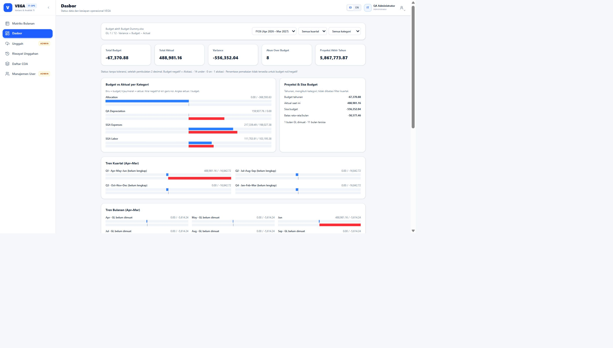

# VEGA QA Report — 7 October 2026

## Scope

Pengujian mencakup tiga lapisan dan satu alur penuh: frontend di browser, backend FastAPI, PostgreSQL, lalu alur pengguna dari login sampai logout. ZIP referensi tidak diubah dan database presentasi tidak dipakai sebagai database uji otomatis. Pengujian destructive/replacement dilakukan pada database PostgreSQL terisolasi dengan nama `vega_test_*`.

## Hasil utama

| Area | Hasil |
|---|---|
| Backend/API + parser Excel | 31 passed, 2 warning non-fatal |
| PostgreSQL integration | 31 passed, 197.29 detik |
| Frontend build/type check | Berhasil; bundle terbaru terlayani di port 3000 |
| Browser admin flow | Login, upload Budget, upload GL, COA, dashboard, matriks, CSV, dan logout diuji |
| RBAC viewer | Endpoint write ditolak 403 dan menu admin disembunyikan |
| Database presentasi | Data tetap sama setelah migrasi session auth: 2 users, 240 COA, 3 batch, 2.856 budget rows, 73 actual rows |
| Health check | `ready` di `http://127.0.0.1:3000/api/v1/health/ready` |

## Bukti angka dashboard

Workbook Budget dan GL diuji melalui UI, kemudian nilainya dibandingkan dengan query PostgreSQL dan CSV matriks:

- Budget aktif: `-67,370.88`
- Aktual GL Juni: `488,981.16` dari 73 baris diterima
- Variance: `-556,352.04`
- Q1: budget `-16,842.72`, aktual `488,981.16`
- Kategori QA Depreciation: aktual `159,937.76`, budget `0.00`
- Matriks menampilkan `-` untuk bulan yang belum dimuat dan `0.00` untuk bulan yang sudah dimuat tetapi nilainya nol.

## Skenario frontend/browser

1. Login password salah menampilkan pesan validasi dan tidak membuka dashboard.
2. Admin login berhasil; sidebar menampilkan Upload dan Manajemen User.
3. File Excel korup sebelumnya mereproduksi blank page karena `duplicates.map` pada data preview yang tidak lengkap. Renderer diperbaiki; file yang sama sekarang ditolak dengan pesan aman tanpa blank page.
4. Budget dipreview, dibatalkan, lalu diunggah ulang dan disimpan. Cancel tidak membuat batch baru.
5. GL dengan account code yang belum ada ditolak dengan daftar kode yang jelas. Setelah COA dibuat lewat UI, GL diterima: 73 baris, total `488981.16`.
6. COA diuji dengan pagination tiga halaman, pencarian, tambah, edit, dan daftar tetap dapat dibaca.
7. Dashboard diuji dengan filter fiscal year, quarter, category, signed bar, KPI, tren bulanan/kuartal, detail akun, dan CSV.
8. Matriks bulanan diuji; hasil CSV dibandingkan dengan angka workbook.
9. Viewer tidak melihat menu admin, upload, atau user management. Akses write langsung tetap ditolak oleh backend.
10. Logout diuji sampai token sesi yang sama tidak bisa dipakai lagi. Reload setelah logout kembali ke login.

## Skenario backend

Suite `tmp/qa/postgresql-final.xml` menjalankan 31 test yang mencakup login rate limit, password byte limit, token expired/tampered, role yang dibaca ulang dari database, logout/session revocation, password reset/deactivation revocation, semua write endpoint viewer/anonymous, parser Budget/GL, invalid workbook, unknown reference, duplicate, period/date validation, dashboard reconciliation terhadap workbook, preview ownership/expiry/replay, replacement transaction, backup failure rollback, pagination, whitespace validation, Uncategorized, dan URL credential decoding.

Perubahan penting yang diverifikasi:

- Session JWT sekarang dicatat di `auth_sessions`; logout, reset password, dan deactivation mencabut sesi.
- Role dibaca ulang dari database sehingga perubahan role berlaku pada request berikutnya.
- Parsing Excel dipindahkan ke threadpool agar parsing workbook tidak memblokir event loop.
- Error 422 menampilkan detail validasi yang relevan.
- Pagination API untuk COA dan riwayat tidak berhenti pada 100 item pertama.

## Skenario database/backup

Database presentasi PostgreSQL dimigrasikan ke revision `0003_auth_sessions` dengan backup plain SQL terlebih dahulu. Perbandingan sebelum/sesudah migrasi identik:

`users=2, coa=240, upload_batches=3, budget_entries=2856, actual_entries=73`.

Helper backup memvalidasi output `pg_dump`, menulis ke file sementara, lalu melakukan rename atomik. `scheduler_backup.ps1` sekarang memanggil helper PostgreSQL yang sama dan tidak lagi menyalin file SQLite lama.

## Temuan yang sudah diperbaiki

- Blank page saat workbook korup.
- Logout yang sebelumnya tidak mencabut token lama.
- Session yang tetap valid setelah password reset/deactivation.
- Menu admin yang terlihat oleh viewer.
- Dashboard yang hanya mengambil 100 batch pertama.
- COA/riwayat yang tidak memiliki pagination.
- Password bcrypt lebih dari 72 byte menghasilkan 500.
- Parsing workbook berat yang memblokir request loop.
- Bar chart tidak membedakan angka negatif dengan baseline nol.

## Batasan yang masih perlu dicatat

- `xlsx@0.18.5` masih terdeteksi satu high severity advisory npm dan belum memiliki jalur upgrade aman tanpa perubahan besar; parser aktif menggunakan `openpyxl`, tetapi dependency legacy tetap ada.
- File `.xls` belum didukung; upload aktif menerima `.xlsx`.
- Auto-register COA dari GL unknown dan badge “GL-derived” belum diimplementasikan; alur saat ini meminta admin membuat COA terlebih dahulu.
- Filter department belum tersedia karena konfigurasi aktif masih satu department MIS.
- UI backup, retention setting, dan audit viewer lengkap belum tersedia; helper backup dan audit backend sudah ada.
- Session timeout saat ini absolute configurable timeout, bukan idle/sliding timeout.
- Pengujian jaringan LAN/production deployment belum dilakukan; yang diverifikasi adalah localhost.

Kesimpulan QA: alur presentasi yang diminta—login, upload Budget/GL, dashboard yang mengikuti data upload, RBAC admin/viewer, matriks/CSV, dan logout—berjalan pada build yang diuji. Batasan di atas perlu diperlakukan sebagai backlog produk, bukan sebagai hasil yang sudah terverifikasi.
